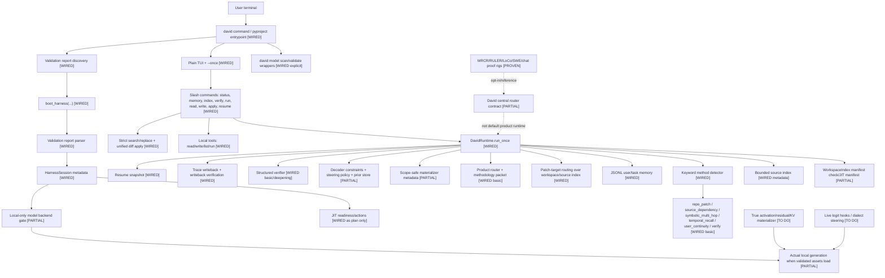
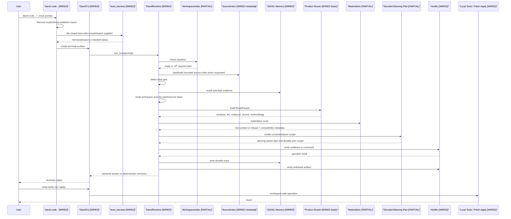

# David Centralized Router Harness

## Overview

This directory contains standalone harness tools for validating memory routing,
model-adapter calibration, and the promoted harness-router contract before
product integration.

The router harness is intentionally small and stdlib-only so benchmark and
smoke workers can exercise the routing contract without depending on the
product runtime. The model config calibrator and validator are also standalone,
but they use `torch` and `transformers` directly when they load open-weight
models.

The harness is not the product default router yet. It now has real Apollo
residual readiness metadata and benchmark Phase-3 consumers can use ready
Apollo stores, but product integration still needs caller-specific adapters,
runtime soak tests, full real benchmark suites, and ownership decisions before
these primitives should be treated as live routing behavior everywhere.

## David Terminal Agent System Status

David now has a working terminal-agent harness prototype with a fail-closed
boot spine, an offline default backend, an optional local-only Transformers
backend, durable memory artifacts, source indexing, routing, verification, and
resume support. It is useful today for local terminal flows, workspace-safe
tools, patch routing, patch application, memory/writeback, and verification
smoke tests. It is not yet the complete hardware-proven open-model,
KV/residual terminal agent.

Status labels:

- `WIRED`: exists in product code and is callable today.
- `PARTIAL`: product-shaped, but shallow, offline, or metadata-only.
- `TO DO`: proven in scripts or designed, but not product-wired yet.

### Current Operator Workflow

Install David from the repo as an editable package so the `david` entrypoint is
on PATH:

```bash
uv pip install -e .
david --help
```

Workspace defaults live in `.david/config.json`. CLI flags and `DAVID_*`
environment variables override these values. Supported keys are:

```json
{
  "model": "google/gemma-4-E2B-it or ./local-model",
  "validation_report": ".david/model_validation_report.json",
  "model_attestation": ".david/model_attestation.json",
  "model_backend": "torch",
  "model_device": "cuda",
  "model_dtype": "bfloat16",
  "model_max_new_tokens": 256,
  "auto_jit_index": false
}
```

The normal local workflow is:

```bash
david doctor --workspace . --model ./models/gemma --validation-report .david/model_validation_report.json
david code .
david verify --cmd "pytest tests/david"
```

Inside `david code .`, the TUI exposes:

- `/status` or `/readiness`: model validation, index, and memory status.
- `/memory`: durable user/task memory artifact status.
- `/index`, `/index jit`, or `/index build`: inspect or refresh workspace
  index surfaces.
- `/resume`: show the last session snapshot.
- `/verify [cmd]`: run the configured verifier or a workspace command.
- `/agent <action>`: run the deterministic local agent/action loop.
- `/read`, `/write`, `/apply`, and `/run`: path-safe local tools. Plain
  prompts that clearly ask for safe file writes may route through the agent
  loop instead of free-form generation.

For a live Gemma run today, use an accepted validator report for auto-load, or
a manual-reviewed `model_attestation.json` for standard decode only:

```bash
david model scan ./models/gemma --output .david/model/model_config_report.json
david model validate .david/model/model_config_report.json --model ./models/gemma --output .david/model_validation_report.json
david code . --model ./models/gemma --model-backend torch --model-device cuda --model-dtype bfloat16
```

Manual attestations do not enable unsafe tensor capabilities. They are an
operator-reviewed path for standard decode when the validator needs human
review, and David must still refuse KV/residual replay that is not proven
compatible for the active model, tokenizer, layers, insertion family, and
memory family.

### Wired Versus Guarded

Wired today:

- CLI/TUI entrypoint, workspace config defaults, `doctor`, `code`, `verify`,
  and explicit `model scan` / `model validate`.
- Startup/model readiness gates, including the doctor command surface. WSL path
  readiness is reported when the corresponding doctor probe is present.
- Torch-runtime live local standard decode when validated assets or an accepted
  manual standard-decode attestation are supplied.
- Direct verifier path, safe plain-write prompts, deterministic `/agent`
  action loop, path-safe file tools, strict patch application, routed context,
  memory, resume, and workspace index surfaces.

Guarded or still TODO:

- Production tensor KV/residual replay. Current product surfaces carry
  compatibility metadata and fail-closed checks; they must not be described as
  completed tensor replay.
- Broad autonomous repo patching. David can perform a guarded read -> patch ->
  verify path and can route, propose, apply focused patches, and verify, but
  broad multi-step repo autonomy remains constrained.
- Benchmark proof rigs. MRCR, RULER, LoCoBench, SWE-bench, and chat rows remain
  proof rigs for methodology validation, not product modules or operator
  commands.

### Top-Level System



### Event Flow Today



### Wired Capabilities

- `david` package entrypoint in `pyproject.toml`.
- CLI/TUI with `/status`, `/memory`, `/index`, `/verify`, `/run`,
  `/read`, `/write`, `/apply`, `/resume`, `/help`, and `/exit`.
- Explicit `david model scan` and `david model validate` wrappers around the
  standalone model getter/validator.
- Validation report discovery for `david code . --model <path>`.
- `DavidRuntime.run_once()` pipeline with offline fallback and validated
  local-backend handoff.
- Separate JSONL user/task memory stores.
- Workspace index readiness, JIT manifest planning, and bounded source index.
- Keyword task detection for repo patch, source dependency,
  symbolic multi-hop, temporal recall, user continuity, and verification.
- Product router methodology packets with source-index enrichment.
- Patch-target routing that prefers source files, preserves tests, and blocks
  protected proof-rig paths.
- Strict patch validation/application for search-replace and unified diffs.
- Path-safe local file tools.
- Scope-safe materializer metadata and refusal behavior for unsafe mixing.
- Decoder steering policy metadata and durable decoder prior store.
- Structured verifier and post-writeback verification metadata.
- Resume snapshots and `/resume` UX.
- `boot_harness(...)` that parses accepted validation reports and returns a
  populated `HarnessSession`.
- Local-only Transformers backend with fail-closed smoke coverage.

### Manual-Reviewed Model Attestations

`david doctor` can surface nearby `model_attestation.json` artifacts for
operator-reviewed configs. This does not relax validator policy: an accepted
validator report remains the auto-load path, while a manual attestation is
standard decode only and unsafe KV/residual replay capabilities are refused.

Example artifact shape:

```json
{
  "schema_name": "david.manual_model_attestation",
  "schema_version": 1,
  "validation_report_sha256": "sha256:original-report-digest",
  "model_identity": "google/gemma-4-E2B-it",
  "tokenizer_identity": "google/gemma-4-E2B-it",
  "model_revision_or_hash": "commit-or-hash",
  "adapter_family": "gemma4",
  "selected_config_sha256": "sha256:canonical-selected-config-digest",
  "allowed_capabilities": ["standard_decode"],
  "reviewer": "operator-id",
  "reviewed_at": "2026-05-04T00:00:00Z",
  "expires_at": "2026-06-04T00:00:00Z",
  "rationale": "Reviewed validator ambiguity for standard decode only."
}
```

### Remaining Production Work

- Run the real Gemma E2B local backend smoke on hardware with WSL
  `torch`/`transformers` or a Windows-visible local model plus CUDA.
- Promote model scan/validate from explicit commands into an optional guided
  onboarding flow.
- Product-wire the full central router instead of the current mini-router.
- Build real activation/residual/KV indexes, not just manifests.
- Implement true adapter-safe KV/residual materialization using captured
  sidecars, not only compatibility metadata.
- Replace steering metadata with live model logit hooks.
- Expand verification from structured metadata checks to semantic patch,
  full chain, temporal-occurrence, and behavioral memory correctness.
- Add multi-step edit planning/apply loops around the backend answer.

## Architecture

- `router.py` is the importable wrapper for the harness router. New callers
  should prefer this path.
- `central router.py` is the temporary compatibility file with the historical
  spaced filename. It still defines the neutral router primitives and
  deterministic routing policy while old benchmark fixtures migrate.
- `smoke_test_central_router.py` checks all supported routing modes with local
  fixtures and asserts full tier coverage.
- `benchmark_row_validation.py` runs one representative local row for MRCR,
  RULER, LoCo, SWE, and Chat-style durable memory validation.
- `get_model_config.py` loads a Hugging Face causal LM and emits a versioned
  report contract with model identity, layer topology, legacy vec-inject
  calibration, query-head ablation, KV source/target candidates, projection
  checks, provenance, warnings, review status, and an
  `adapter_config_candidate`.
- `validate_model_config.py` consumes a config getter report and validates it
  before harness adapter loading. It checks report integrity, layer topology,
  model identity, tensor projection viability, and Phase 2 behavioral
  prefix-cache layer ablation, then emits an auto-load policy.

Core data flow:

1. A `RouteRequest` names the capability mode, query, scope, path hints,
   identifiers, entities, adapter/index readiness metadata, first-class
   chat/code artifacts, temporal user metadata, code/task metadata, and policy
   metadata.
2. Candidate `RouteWindow` objects carry text, source path, temporal scope,
   memory authority, stale/superseded state, adapter/index metadata, artifact
   metadata, and route metadata.
3. `CentralRouter.route(request, windows)` validates adapter/index
   compatibility first. Fast route index readiness proves only that windows can
   be scored and selected for the active adapter.
4. If Apollo residual/KV materialization readiness is requested, the router
   separately validates `ApolloResidualReadinessMetadata`. Sparse
   `status=ready` metadata is not enough; the request must carry positive
   manifest/path/count/source-layer evidence.
5. If `allow_jit_indexing` is set and required route indexes or Apollo residual
   artifacts are missing or incompatible, the router raises
   `JITIndexingRequired` before scoring so a production harness can build the
   index or residual store and re-enter routing.
6. Once readiness is proven, the router dispatches to the mode-specific scorer,
   rejects unknown modes by default, optionally falls back to `general_recall`
   only when `allow_mode_fallback` is set, ranks `RouteCandidate` objects,
   assigns tiers, and builds a `MaterializationPlan`.
7. `RoutePlan` returns candidates, tier assignments, evidence supports,
   materialization metadata, the selected candidate, and a `RoutePacket`.
8. `RoutePlan.assert_tier_coverage()` enforces the tier invariant before a plan
   is returned.

The distinction between the older central-router surface and the promoted
harness-router surface is proof. The central router scores windows and returns
ranked tiered plans. The harness router contract additionally proves adapter
validity, index compatibility and readiness, synthetic benchmark metadata
injection boundaries, decode policy, verification expectations, and write-back
policy in the returned `RoutePacket`.

## Key Concepts

- Capability mode: the routing behavior requested by a benchmark row, product
  workflow, or smoke fixture.
- Candidate: a scored route window with reasons, evidence, and trace metadata.
- Evidence support: a proof-like record explaining why a window participates in
  the route.
- Apollo residual readiness: residual/KV materialization evidence derived from
  a real Apollo manifest or live store. It is separate from fast route index
  readiness and tracks manifest/store paths, window counts, boundary/residual
  counts, source/target layer identity, source window refs, and KV-direct
  readiness.
- Materialization plan: the concrete HOT, WARM, and COLD windows a downstream
  caller would materialize, plus payload tiers, token budget, residual/KV paths,
  Apollo manifest/store identity, recapture requirements, decode constraints,
  verification expectations, and write-back targets.
- Adapter metadata: model family/revision/hash, tokenizer identity, adapter
  version, route/boundary/injection layers, route dimension, and KV layout.
- Index readiness metadata: index id, adapter key/version, status, build
  timestamp, model/tokenizer identity, route/boundary/injection layers, route
  dimension, and KV layout. With active adapter metadata, ready indexes must
  positively match the adapter identity; sparse `status=ready` metadata is not
  enough. Pending, missing, failed, building, in-flight, or incompatible indexes
  are rejected. If JIT indexing is explicitly allowed, the router raises
  `JITIndexingRequired` as a stop-and-reenter contract rather than returning a
  route with a pending index.
- Compatibility proof: `CompatibilityProof` records adapter compatibility,
  fast route readiness, Apollo residual readiness, checked window ids,
  adapter/index/Apollo identity, and any JIT-indexing actions. On a JIT stop,
  the proof is carried by `JITIndexingRequired`.
- Route packet: `RoutePacket` packages selected memory, evidence, tiering,
  `CompatibilityProof`, `MaterializationPlan`, `DecodePolicy`,
  `VerificationPlan`, and `WriteBackPolicy`.
- First-class artifacts: `ChatUserMemoryArtifact` carries user memory scope,
  freshness, local time, confidence, conflict, sensitivity, and artifact path
  fields; `CodeTaskMemoryArtifact` carries workspace, task, source, symbol,
  dependency, test/failure, patch-target, commit, and artifact path fields.
- Router metadata: inspectable route details such as selected window id,
  eligible window count, tiers present, filtered stale memory ids, and
  mode-specific traces.

## Benchmark Adapter Boundary

MRCR, RULER, LoCo, SWE, and Chat rows in this directory are adapters/fixtures
that call capability requests. They are not the product ontology. The harness
uses them to prove that external benchmark shapes can be translated into
neutral router capabilities without embedding benchmark-specific concepts into
runtime data models.

Bridge-injected synthetic benchmark adapter/index metadata is treated as
fixture metadata at the adapter boundary. It may prove compatibility,
readiness, decode, verification, and write-back behavior for representative
rows, but it is not evidence that product callers have adopted the router or
that full benchmark suites have passed.

For real Apollo/KV paths, the bridge does not synthesize benchmark readiness.
Callers use `readiness_source="apollo_manifest"` and provide a real
`manifest.json`; the bridge derives adapter, fast index, and Apollo residual
metadata from that manifest. Missing or incompatible manifest readiness must
stop routing or trigger the JIT/re-entry path when explicitly allowed.

## Apollo Residual Sidecar

The benchmark JIT indexer keeps the fast route pass intact and adds an Apollo
sequential residual sidecar beside each case store. The fast route query path
still uses:

- `activation_routes.npy`
- `window_tokens.npz`

The Apollo sidecar adds:

- `boundaries/window_000.npy`
- `residual_streams/window_000.npy`
- `boundary_residual.npy`
- `manifest.json`

The sidecar follows the prepend/initial-residual chain:

```text
boundary = None
for window_id in document_order:
    h = forward_window_to_boundary_layer(tokens, initial_residual=boundary)
    save residual_streams/window_id
    save boundaries/window_id
    boundary = h[:, -1:, :]
```

LoCo Phase 3 and SWE through the shared LoCo path now prefer a ready Apollo
store for selected windows. They validate manifest readiness, source/injection
layer identity, runtime layer compatibility, and selected window ids before
materializing KV. If no compatible Apollo store is available, the existing
Layer-13 recapture path remains the fallback unless strict Apollo mode is
requested.

## Routing Capabilities

- `temporal_ordinal`: resolves scoped duplicate requests by ordinal position,
  used by MRCR-style "third occurrence" rows.
- `symbolic_chain`: follows assignment-style chains and records evidence for
  each step, used by RULER-style variable/value rows.
- `dependency_source`: favors source and dependency windows from path hints,
  identifiers, activation metadata, and recursive route traces.
- `patch_target`: extends dependency routing for SWE-style patch planning,
  prioritizing implementation source over tests, docs, assets, and padding
  while preserving selected test metadata.
- `durable_chat_memory`: routes current durable memory, separates user memory
  from task/tool memory, and filters stale or superseded memories before active
  tiering.
- `general_recall`: provides fallback lexical, literal, and entity-style recall.

Unknown `capability_mode` values are strict by default and raise `ValueError`.
Set metadata `allow_mode_fallback` only for callers that intentionally want an
unknown mode to fall back to `general_recall`; the route metadata records that
fallback when it occurs.

## HOT/WARM/COLD Tier Invariant

Every routing mode must return HOT, WARM, and COLD tier windows whenever at
least three eligible windows exist. This is a hard harness invariant, not a
best-effort preference:

- `tier_assignments` must contain non-empty HOT, WARM, and COLD assignments.
- `materialization_plan.tier_window_ids` must also contain HOT, WARM, and COLD.
- `RoutePlan.assert_tier_coverage()` raises if either surface omits a required
  tier.

Rows with fewer than three eligible windows may legitimately omit lower tiers,
but all current smoke and benchmark-row fixtures are designed to exercise the
full HOT/WARM/COLD guarantee.

## Running Validations From WSL

From Windows PowerShell, run the smoke test through the default WSL login
environment and the repo root:

```bash
wsl --cd /mnt/c/Users/jehma/Desktop/lazarus/chuk-lazurus -- bash -lc 'python3 David/smoke_test_central_router.py'
```

Run the benchmark-row validation:

```bash
wsl --cd /mnt/c/Users/jehma/Desktop/lazarus/chuk-lazurus -- bash -lc 'python3 David/benchmark_row_validation.py'
```

Run one benchmark row by name, benchmark, or capability:

```bash
wsl --cd /mnt/c/Users/jehma/Desktop/lazarus/chuk-lazurus -- bash -lc 'python3 David/benchmark_row_validation.py --row MRCR'
wsl --cd /mnt/c/Users/jehma/Desktop/lazarus/chuk-lazurus -- bash -lc 'python3 David/benchmark_row_validation.py --row temporal_ordinal'
```

From inside WSL after changing into the repo root, the equivalent commands are:

```bash
python3 David/smoke_test_central_router.py
python3 David/benchmark_row_validation.py
python3 David/benchmark_row_validation.py --row Chat
```

Expected results are JSON summaries with passing status, selected window ids,
tier counts or tier lists, route trace metadata, and explicit confirmation that
the HOT/WARM/COLD coverage checks passed.

These commands are local representative rows and smoke tests. They are useful
contract checks for `RoutePacket`, `CompatibilityProof`, `router.py` imports,
strict unknown-mode behavior, and benchmark adapter boundaries, but they are
not full real MRCR, RULER, LoCo, SWE-bench, or chat memory benchmark suites.

## Running Model Config Calibration From WSL

`get_model_config.py` is standalone. It does not import Lazarus runtime or the
older calibration examples. Use it when onboarding a model adapter or checking
whether a better KV source/target pair exists than the current hand-written
config.

The JSON report is harness-ready rather than product-registry-mutating. It
includes `schema_name`, `schema_version`, provenance, structured warnings,
recommendation review state, and `adapter_config_candidate`. Future harness
consolidation can accept a user-supplied model, run this getter beside JIT
readiness checks, and load the adapter candidate automatically once confidence
is ready.

Review semantics are intentionally conservative. Legacy/KV disagreement marks
the recommendation `review_required`; a strong legacy match with a safe margin
can still be `ready` when head scanning is unavailable; low-confidence output
can be promoted to a failing process with `--fail-on-low-confidence`.
Gemma/Qwen/Llama-ish adapter-family and projection aliases are recognized, and
hook or projection introspection failures are reported as structured
diagnostics instead of silent gaps.

Model/dependency load failures also emit a versioned JSON report when
`--json-out` is supplied. The report carries `status="failed"`, a structured
`failure` section, unavailable calibration sections, and a `review_required`
adapter candidate so harness startup can stop cleanly instead of parsing a
traceback.

Inspect-only topology report:

```bash
wsl --cd /mnt/c/Users/jehma/Desktop/lazarus/chuk-lazurus -- bash -lc 'uv run python David/get_model_config.py --model HuggingFaceTB/SmolLM2-360M-Instruct --inspect-only'
```

Measured narrow Gemma-4 E2B run around the current and discovered KV bands:

```bash
wsl --cd /mnt/c/Users/jehma/Desktop/lazarus/chuk-lazurus -- bash -lc 'uv run python David/get_model_config.py --model /home/jehmal/.cache/huggingface/hub/models--google--gemma-4-E2B-it/snapshots/b4a601102c3d45e2b7b50e2057a6d5ec8ed4adcf --device cuda --dtype bfloat16 --scan-layers 13,14,18,19 --max-probes 1 --max-heads 2 --max-candidates 6 --json-out /tmp/gemma4_config_smoke.json'
```

Write JSON to Windows temp from WSL:

```bash
wsl --cd /mnt/c/Users/jehma/Desktop/lazarus/chuk-lazurus -- bash -lc 'uv run python David/get_model_config.py --model HuggingFaceTB/SmolLM2-360M-Instruct --inspect-only --json-out /mnt/c/Users/jehma/AppData/Local/Temp/smollm2_config.json'
```

For a fuller calibration, remove the smoke limits or use `--top-layers 0` to
scan the top third of the model. The report separates `legacy_vec_inject` from
`kv_candidates` so the old `injection_layer` peak is not confused with the
KV-direct `kv_source_layer`.

## Running Model Config Validation From WSL

`validate_model_config.py` is the load gate for `get_model_config.py` reports.
It is isolated from Lazarus runtime plumbing and writes a separate validation
artifact rather than mutating any adapter registry.

Validation phases:

1. Report integrity: schema, required candidate shape, and machine-readable
   warnings.
2. Topology: source/target layer range checks and source-before-target checks.
3. Model identity: actual loaded model/config identity compared with the source
   report.
4. Projection gate: captured residual vectors are projected through candidate
   K/V modules and checked for finite, non-zero tensors.
5. Phase 2 behavior gate: a probe fact is prefetched into a real KV cache, the
   answer probability is measured with and without the cache, and each
   candidate's resolved cache layer is ablated to prove the layer materially
   affects recall.
6. Decision: the validator emits `validation_status`, `confidence`,
   `selected_config`, `behavior_gate`, `harness_load_policy`, and
   `auto_load_allowed`.

The Phase 2 behavior gate is a real prefix-cache layer-ablation test. It proves
the selected cache layer affects recall, including model-family quirks such as
Gemma4 logical layers mapping to shared physical cache layers. It is not a full
harness KV-direct injection replay test yet.

Dry-run smoke, which checks report/topology plumbing without loading the model:

```bash
wsl --cd /mnt/c/Users/jehma/Desktop/lazarus/chuk-lazurus -- bash -lc 'uv run python David/validate_model_config.py --config-report /mnt/c/Users/jehma/AppData/Local/Temp/gemma4_e4b_python_model_config_latest.json --dry-run --json-out /mnt/c/Users/jehma/AppData/Local/Temp/gemma4_e4b_validate_smoke.json'
```

Actual validation with behavioral KV required:

```bash
wsl --cd /mnt/c/Users/jehma/Desktop/lazarus/chuk-lazurus -- bash -lc 'uv run python David/validate_model_config.py --config-report /mnt/c/Users/jehma/AppData/Local/Temp/gemma4_e4b_python_model_config_latest.json --device cuda --dtype bfloat16 --require-behavioral-kv --json-out /mnt/c/Users/jehma/AppData/Local/Temp/gemma4_e4b_validation_phase2_actual.json'
```

On the Gemma E4B validation run, the accepted adapter candidate was:

```json
{
  "route_layer": 27,
  "boundary_layer": 28,
  "kv_source_layer": 28,
  "kv_target_layer": 29,
  "injection_layer": 29,
  "behavior_cache_layer": 23,
  "candidate_role": "adapter_config_candidate+recommended+kv_candidate_0"
}
```

That run returned `validation_status="accepted"`, `confidence="high"`, and
`auto_load_allowed=true`. Harness consolidation should treat that combination
as the point where startup can load the measured adapter config automatically,
subject to the separate workspace JIT readiness checks.
