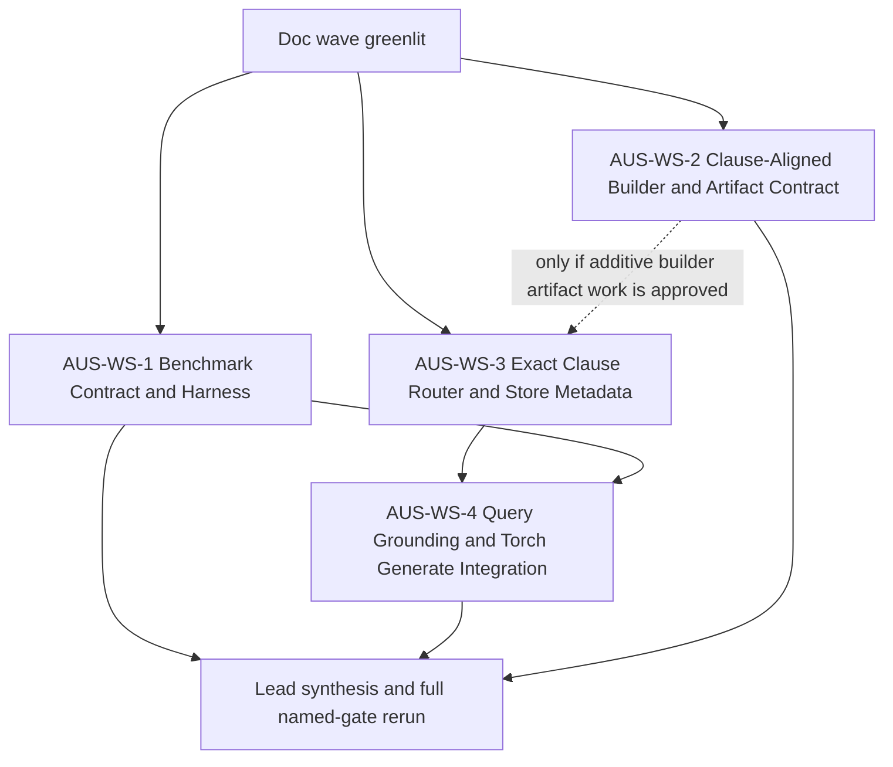

# AUS3000 Epic 1: Parallel Implementation Workstreams

## 1. Purpose

This document partitions the AUS3000 100% accuracy program into
non-conflicting implementation workstreams for the post-doc phase. It is the
parallel-execution companion to `01-implementation-spec.md` and
`03-benchmark-definition.md`.

Current evidence shows four distinct change surfaces:

- The clause-aligned builder already writes clause metadata and alias-enriched
  token windows in
  `tools/build_aus3000_clause_aligned_variant.py` (`build_metadata_aliases`,
  `add_metadata_alias_tokens`, `window_metadata`, sidecar metadata).
- The runtime still routes with query expansion plus TF-IDF overlap through
  `src/chuk_lazarus/inference/context/knowledge/torch_query.py`,
  `src/chuk_lazarus/inference/context/knowledge/torch_store.py`, and
  `src/chuk_lazarus/inference/context/knowledge/route.py`.
- The torch checkpoint generate path in
  `src/chuk_lazarus/cli/commands/context/generate/_torch.py` shares the same
  knowledge-store response path and must not regress existing Lazarus generate
  flows.
- The evaluator in `tools/evaluate_aus3000_variant.py` hard-codes the suite,
  uses a duration loop, and scores routed windows with a fuzzy
  `routed_match()` heuristic instead of an exact clause-safe gate.

The current clause-aligned baseline in the brief remains:

- `423 executed / 310 PASS / 38 REVIEW / 75 FAIL`
- Stable FAIL cluster: `accessible_definition`, `accessible_vs_readily`,
  `switchboard_definition`, `insulation_resistance_results`
- Stable REVIEW cluster: `insulated_definition`, `rcd_definition`

The split below is designed to get to 100% PASS without touching base Gemma
weights and without regressing normal Lazarus knowledge/query/generate flows.

## 2. Evidence Driving the Split

- `tools/build_aus3000_clause_aligned_variant.py` already serializes
  `window_metadata.json` with `clause_id`, `clause_title`, `source_file`,
  `part_index`, `part_count`, `token_count`, and `content_was_empty`. The live
  clause-aligned store currently exposes that metadata for `1203` windows.
- `build_metadata_aliases()` and `add_metadata_alias_tokens()` already enrich
  builder-time window tokens with clause-id and title aliases, but the query
  path does not parse exact clause ids or title aliases before TF-IDF routing.
- `_prepare_store_response()` currently does:
  query expansion -> `route_top_k()` -> fallback `route(..., method="auto")` ->
  prompt-context or residual generation.
- `run_torch_checkpoint_generate()` in `_torch.py` either delegates to
  `run_torch_query_command()` or uses a manual explicit replay path; this file
  must remain under a single owner with `torch_query.py` to avoid divergent
  behavior.
- `tools/evaluate_aus3000_variant.py` currently:
  - defines the suite inline in `build_case_suite()`
  - treats a routed window as a match when its text merely contains the
    expected clause id or title
  - loops by duration in `main()` instead of enforcing a single fixed benchmark
    pass
  - still defaults to the older `gemma4_aus3000_variant` paths

## 3. Shared Rules

Every workstream below must follow these rules:

- Only edit files inside its owner scope.
- Treat files in other streams as read-only, even if a local shortcut would be
  easier.
- If a stream believes it must widen scope, stop and escalate to the lead
  instead of crossing boundaries.
- Do not touch base Gemma model weights, existing generic Lazarus flows, or
  unrelated local user changes.
- Keep the clause-aligned variant and normal non-AUS3000 flows backward
  compatible. Additive sidecar or manifest fields are allowed; breaking schema
  changes are not.
- New tests should mirror the owned source path under `tests/`.
- No stream may claim success from ad hoc prompts. Benchmark-green only counts.
- The benchmark definition in `03-benchmark-definition.md` is the scoring
  source of truth. This file only partitions implementation ownership.

### 3.1 Normative Benchmark Constants Imported From `03-benchmark-definition.md`

All implementation streams must use the same frozen constants:

- Canonical checkpoint path:
  `/mnt/c/Users/jehma/Desktop/AI/TradeGuru/lewisnjehmal/downloads/standards/embeddings/AS_NZS_3000-2018/gemma4_aus3000_clause_aligned_variant`
- Canonical store path:
  `/mnt/c/Users/jehma/Desktop/AI/TradeGuru/lewisnjehmal/downloads/standards/embeddings/AS_NZS_3000-2018/gemma4_aus3000_clause_aligned_variant/torch_store`
- Benchmark mode ordering:
  `store_evidence_gate -> single_pass_gate -> soak_gate`
- Authoritative counted gate:
  `single_pass_gate`
- Exact-address routing scope:
  use existing `window_metadata.json` first for exact clause-id and normalized
  clause-title routing, with TF-IDF retained as the backstop. No `kvectors_full`
  or heavier Apollo-style exact factual path is required unless the metadata-first
  route fails.
- Named gates:
  `store_evidence_gate`, `route_gate`, `grounding_gate`, `ood_gate`,
  `no_regression_gate`, `single_pass_gate`, `soak_gate`

`03-benchmark-definition.md` remains the normative benchmark source of truth. `AUS-WS-1`
owns implementation of the named benchmark gates and their runnable command surface.

## 4. Dependency Plan

Execution notes:

- `AUS-WS-1` and `AUS-WS-2` can start immediately in parallel.
- `AUS-WS-3` can start immediately from the existing `window_metadata.json`
  contract. `AUS-WS-2` only blocks `AUS-WS-3` if the lead approves a new additive
  builder artifact beyond the current metadata path.
- `AUS-WS-4` depends on `AUS-WS-3` because it must consume the exact routed
  clause/window selection instead of duplicating routing logic.
- Lead synthesis closes only after the named benchmark gates are green against the
  canonical clause-aligned checkpoint/store.

## 5. Workstreams

### AUS-WS-1: Benchmark Contract and Harness

Stabilize the production gate before broad runtime changes. This stream owns
the exact benchmark suite, exact routed-match logic, and the reproducible
evaluation command surface.

| Field | Value |
|---|---|
| Owner scope | `tools/evaluate_aus3000_variant.py`; new `tests/tools/test_evaluate_aus3000_variant.py`; new machine-readable benchmark fixture(s) under `tests/fixtures/aus3000/benchmark/` |
| Forbidden | `tools/build_aus3000_clause_aligned_variant.py`; `src/chuk_lazarus/inference/context/knowledge/route.py`; `src/chuk_lazarus/inference/context/knowledge/torch_store.py`; `src/chuk_lazarus/inference/context/knowledge/torch_query.py`; `src/chuk_lazarus/cli/commands/context/generate/_torch.py`; all CLI command files outside new tests |
| Inputs | Doc pack approved; current clause-aligned report; current live `window_metadata.json` shape; benchmark definition from `03-benchmark-definition.md` |
| Outputs / Acceptance | Inline hard-coded suite moved behind a stable machine-readable source or equivalent frozen contract; routed-window scoring is exact-clause safe; strict scorer/harness implements `store_evidence_gate`, `route_gate`, `grounding_gate`, `ood_gate`, `no_regression_gate`, `single_pass_gate`, and `soak_gate`; evaluator defaults target the clause-aligned checkpoint or require explicit arguments; baseline reproduction commands are separated from counted strict-gate commands; REVIEW is removed from counted benchmark modes |
| Validation gates | `pytest tests/tools/test_evaluate_aus3000_variant.py`; runnable `store_evidence_gate` against all 16 unique primary clauses in the canonical store; runnable `single_pass_gate` against the canonical checkpoint/store; runnable `soak_gate` command surface for repeated strict scoring; manual spot-check that `accessible_definition`, `switchboard_definition`, and `rcd_definition` no longer receive routed credit from unrelated windows |
| Reviewer expectations | Verify every gold case maps to the intended clause id(s); verify `routed_match()` no longer grants credit from substring-only title/id presence; verify the default/required checkpoint path matches the clause-aligned baseline named in the brief; verify the final command surface is reproducible, versionable, and owns every named benchmark gate |

### AUS-WS-2: Clause-Aligned Builder and Artifact Contract

Own the clause-aligned build-side contract: metadata, alias serialization, and
reproducible sidecar/manifests for future exact routing.

| Field | Value |
|---|---|
| Owner scope | `tools/build_aus3000_clause_aligned_variant.py`; new `tests/tools/test_build_aus3000_clause_aligned_variant.py` |
| Forbidden | `tools/evaluate_aus3000_variant.py`; `src/chuk_lazarus/inference/context/knowledge/route.py`; `src/chuk_lazarus/inference/context/knowledge/torch_store.py`; `src/chuk_lazarus/inference/context/knowledge/torch_query.py`; `src/chuk_lazarus/cli/commands/context/generate/_torch.py`; generic knowledge builder/runtime files outside the clause-aligned tool |
| Inputs | Current clause-aligned build script; current external `window_metadata.json`; spec decisions on which alias fields or metadata guarantees are required for exact-address routing |
| Outputs / Acceptance | Clause-aligned artifacts remain additive and backward compatible; any new metadata or alias artifacts are deterministic and documented in the checkpoint sidecar/manifest; build flow remains torch sidecar only and does not overwrite existing checkpoints without explicit force; clause metadata continues to preserve per-window clause identity and part boundaries; any builder-side additions are conditional and only justified if the current `window_metadata.json` path proves insufficient |
| Validation gates | `pytest tests/tools/test_build_aus3000_clause_aligned_variant.py`; `python tools/build_aus3000_clause_aligned_variant.py --help`; builder-focused fixture tests covering alias generation, metadata serialization, and manifest fields; consumer-compatibility proof through `_validate_torch_checkpoint()` in `src/chuk_lazarus/cli/commands/context/generate/_torch.py` and `TorchKnowledgeStore.load()` in `src/chuk_lazarus/inference/context/knowledge/torch_store.py` against the produced artifacts |
| Reviewer expectations | Verify all new sidecar/manifest fields are additive; verify serialization is deterministic across runs; verify no consumer file was edited from this stream; verify output still reflects the clause-aligned design, not a return to flat token windows; verify additive artifacts remain loadable by the real torch consumers |

### AUS-WS-3: Exact Clause Router and Store Metadata

Implement exact clause-id, title-alias, and metadata-aware routing without
touching answer generation. This stream owns the runtime selection logic.

| Field | Value |
|---|---|
| Owner scope | `src/chuk_lazarus/inference/context/knowledge/route.py`; `src/chuk_lazarus/inference/context/knowledge/torch_store.py`; optional new helper modules under `src/chuk_lazarus/inference/context/knowledge/` that are strictly router/store focused; existing `tests/inference/context/test_torch_store.py`; new `tests/inference/context/test_aus3000_clause_route.py` |
| Forbidden | `tools/build_aus3000_clause_aligned_variant.py`; `tools/evaluate_aus3000_variant.py`; `src/chuk_lazarus/inference/context/knowledge/torch_query.py`; `src/chuk_lazarus/cli/commands/context/generate/_torch.py`; `src/chuk_lazarus/cli/commands/context/generate/_cmd.py`; `src/chuk_lazarus/cli/commands/knowledge/**` |
| Inputs | `AUS-WS-1` benchmark contract frozen; current external `window_metadata.json` and clause-aligned report; `AUS-WS-2` only if a new additive builder artifact is approved |
| Outputs / Acceptance | Runtime can parse exact clause ids and exact-address prompts before TF-IDF fallback; title/alias normalization is explicit and tested; metadata-aware routing can expose exact clause/window identity to downstream callers; current stable misses (`accessible_definition`, `accessible_vs_readily`, `switchboard_definition`, `insulation_resistance_results`) route to the intended clause windows under test fixtures; non-AUS3000 generic routing still degrades safely to existing behavior |
| Validation gates | `pytest tests/inference/context/test_torch_store.py`; `pytest tests/inference/context/test_aus3000_clause_route.py`; router-specific unit tests for clause id extraction, alias normalization, and effective-top-k selection; targeted fixture tests proving wrong current windows (`76`, `46`, `492`, `1091`, `1162`) are no longer selected for the stable failure prompts |
| Reviewer expectations | Verify `route.py` and `torch_store.py` remain the only runtime selection owners; verify exact routing uses existing metadata and normalization rather than more prompt-side heuristics; verify generic stores without AUS3000 metadata still load and route safely; verify no generation/CLI behavior changed in this stream |

### AUS-WS-4: Query Grounding and Torch Generate Integration

Consume the exact router output and make the answer path deterministic and
grounded across `knowledge query` and torch checkpoint `context generate`
without reopening generic generate modes.

| Field | Value |
|---|---|
| Owner scope | `src/chuk_lazarus/inference/context/knowledge/torch_query.py`; `src/chuk_lazarus/cli/commands/context/generate/_torch.py`; existing `tests/inference/context/test_torch_query_helpers.py`; existing `tests/cli/commands/context/generate/test_cmd_torch.py`; existing `tests/cli/commands/knowledge/test__query_backend.py`; existing `tests/cli/commands/knowledge/test__chat_backend.py`; new `tests/inference/context/test_aus3000_torch_query.py` |
| Forbidden | `src/chuk_lazarus/inference/context/knowledge/route.py`; `src/chuk_lazarus/inference/context/knowledge/torch_store.py`; `tools/build_aus3000_clause_aligned_variant.py`; `tools/evaluate_aus3000_variant.py`; `src/chuk_lazarus/cli/commands/context/generate/_cmd.py`; other `context generate` mode files under `_modes/`; `src/chuk_lazarus/cli/commands/knowledge/**` source files unless the lead explicitly re-scopes the stream |
| Inputs | `AUS-WS-1` benchmark contract merged; `AUS-WS-3` exact router/store merged |
| Outputs / Acceptance | `knowledge query`, `knowledge chat`, and torch checkpoint `context generate` share one grounded response contract; matched-clause replay is deterministic; exact clause lookups stop drifting into unrelated EV or MIMS material; insufficiency behavior remains explicit for out-of-domain prompts; existing manual replay, `--find`, and `--no-chat-template` flows continue to dispatch correctly |
| Validation gates | `pytest tests/inference/context/test_torch_query_helpers.py`; `pytest tests/cli/commands/context/generate/test_cmd_torch.py`; `pytest tests/cli/commands/knowledge/test__query_backend.py`; `pytest tests/cli/commands/knowledge/test__chat_backend.py`; `pytest tests/inference/context/test_aus3000_torch_query.py`; optional targeted smoke on the clause-aligned checkpoint after narrow tests pass |
| Reviewer expectations | Verify `_torch.py` and `torch_query.py` remain behaviorally aligned; verify no changes leaked into `_cmd.py` or unrelated generate modes; verify prompt construction only uses retrieved matched facts/windows; verify out-of-domain prompts still refuse cleanly without electrical bleedthrough |

## 6. Conflict Hotspots

These are the places most likely to cause accidental overlap:

- `src/chuk_lazarus/inference/context/knowledge/torch_store.py`
  This file belongs only to `AUS-WS-3`. Benchmark code must consume store
  metadata read-only rather than editing the loader for convenience.
- `src/chuk_lazarus/inference/context/knowledge/torch_query.py` and
  `src/chuk_lazarus/cli/commands/context/generate/_torch.py`
  These files stay together in `AUS-WS-4`. Splitting them would create two
  answer paths.
- `tests/fixtures/aus3000/benchmark/`
  This subtree belongs to `AUS-WS-1`. Other streams may consume those fixtures
  read-only but must not change expected cases or verdict rules.
- `tests/inference/context/test_aus3000_clause_route.py`
  This new file belongs only to `AUS-WS-3`.
- `tests/inference/context/test_aus3000_torch_query.py`
  This new file belongs only to `AUS-WS-4`.
- Existing generic CLI entrypoints
  `_cmd.py` and `src/chuk_lazarus/cli/commands/knowledge/**` stay read-only
  unless the lead creates a follow-up stream. Current evidence does not justify
  reopening them yet.

## 7. Review Wave Plan

One independent reviewer is required per workstream after implementation:

- Benchmark reviewer
  Checks exact case definitions, exact scoring logic, fixed command lines, and
  no fuzzy routed-window credit.
- Builder reviewer
  Checks additive artifact contract, deterministic metadata, and no runtime
  edits.
- Router reviewer
  Checks exact-address routing behavior, generic-store safety, and file-scope
  discipline.
- Grounding reviewer
  Checks deterministic answer path, torch generate compatibility, and no
  regression of existing replay/manual flows.

Lead synthesis closes the wave only after:

- all stream-specific validation gates are green
- the owner scopes stayed disjoint
- the benchmark contract and implementation behavior agree
- `store_evidence_gate`, `route_gate`, `grounding_gate`, `ood_gate`,
  `no_regression_gate`, `single_pass_gate`, and `soak_gate` are green on the
  canonical clause-aligned checkpoint/store
- the next benchmark rerun plan is unambiguous

## 8. Known Evidence Gaps

These gaps do not block the split, but they should be tracked:

- There is no checked-in AUS3000 mini-fixture yet for router/evaluator unit
  tests; the benchmark stream will need to establish one under `tests/fixtures/`
  or equivalent.
- There are no existing repo tests dedicated to
  `tools/build_aus3000_clause_aligned_variant.py` or
  `tools/evaluate_aus3000_variant.py`; both streams will need to create their
  own test surfaces.
- The final machine-readable benchmark case file path is not yet fixed by
  `03-benchmark-definition.md`; this workstreams doc reserves
  `tests/fixtures/aus3000/benchmark/` for that purpose.
- The live external `window_metadata.json` contains clause identity but not a
  dedicated precomputed alias map. If `AUS-WS-2` adds one, it must remain
  additive and `AUS-WS-3` must consume it read-only.
