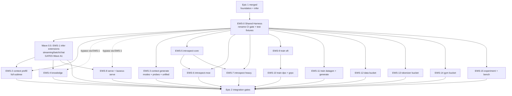

# Epic 2: Dual-Backend CUDA — All-Buckets Parallel Workstreams

## 1. Purpose

This document partitions the Epic 2 implementation (see
[`02-implementation-spec.md`](./02-implementation-spec.md), sibling
[`01-command-matrix.md`](./01-command-matrix.md), and validation plan in
[`04-validation-matrix.md`](./04-validation-matrix.md)) into
non-conflicting, file-scoped workstreams across **every CLI bucket** in
`chuk-lazarus`.

Epic 1 (`../dual-backend-cuda/02-workstreams.md`) landed the dual-backend
**foundation**: registry, lazy MLX imports under `inference/`, torch
backend with CUDA detection, CLI `--backend`/`--device` flags on
`infer run`, packaging extras. Epic 2 extends that foundation across the
remaining CLI surface — every subcommand must honour `CHUK_BACKEND`
and/or `--backend`/`--device` without regressing MLX on macOS.

Every workstream below assumes Epic 1 is **fully merged to `main` with
green CI**. Epic 2 never re-opens Epic 1 scope.

Rules every workstream MUST follow (inherited from Epic 1 §1 and
extended):

- Only edit files inside its **Owner scope**. Never edit files listed
  in its **Forbidden** set (owned by another stream or by Epic 1).
- Respect **Inputs** — do not start until upstream streams have
  **merged to `main` with green CI** (not just PR-approved).
- **MLX preservation is non-negotiable.** Every stream must:
  (a) keep the existing MLX code path bit-for-bit behaviour-equivalent
  on macOS;
  (b) make every new or touched MLX import method-local (lazy);
  (c) add or extend a regression test under
  `tests/<bucket>/test_<file>_mlx_regression.py` that asserts the MLX
  output/path matches the pre-Epic-2 snapshot (golden file, tolerance
  documented per stream).
- **Backend dispatch pattern.** Any site that performs tensor ops,
  model loads, or device placement must dispatch through
  `chuk_lazarus.models_v2.core.backend.get_backend(name, device,
  check_sm)` (Epic 1 §4.2). Never import `mlx.core` or `torch`
  unconditionally at module scope from an Epic 2 in-scope file.
- **Parser + command + types triad.** Buckets that expose a CLI
  subcommand ship three coordinated edits in the SAME workstream:
  the argparse registration under `cli/_parsers/_<bucket>.py`, the
  command entrypoint under `cli/commands/<bucket>/`, and the typed
  dataclass under `cli/commands/<bucket>/_types.py` (or the bucket's
  equivalent). No stream is allowed to ship only a parser edit without
  the matching command/types edit (and vice versa), because the CLI
  smoke test in §9 imports all three.
- New test files live under `tests/` mirroring the source path. If an
  existing test module at the mirrored path already covers the source
  file, extend it rather than create a parallel file unless the
  workstream explicitly lists a **new** module.
- Glob semantics: `foo/` and `foo/**` mean the entire subtree under
  `foo/`. `foo/*.py` means only direct children. Owner scopes list each
  file explicitly; forbidden sets may use either form but are read as
  subtree-inclusive when written as `foo/` or `foo/**`.
- The Epic 1 CI gate `tests/ci/test_no_top_level_mlx.py` is **extended**
  by every stream below: each stream appends its owned files to
  `EPIC_1_IN_SCOPE` (rename to `BACKEND_IN_SCOPE` in the first Epic 2
  stream to merge, see EWS-0). This is the only permitted shared-edit
  across Epic 2 workstreams; all other conflicts are bugs.
- **Split-declaration authority.** Several workstreams (EWS-6 MoE
  monolith-vs-submodule, EWS-9/10 `training/trainers/` file-level split
  where relevant, EWS-14/15 bench-delegation, EWS-15 `_bench.py` vs
  standalone handler) require a "declare at start" decision. The
  **primary authority** is the Epic 2 team-lead. If the team-lead is
  unavailable for **2 business days** after the executing agent
  requests a decision (timestamped in the PR), authority falls through
  to the following named backups in order: (1) the Epic 2 spec-author
  (owns `02-implementation-spec.md`), (2) the Epic 2 validation-author
  (owns `04-validation-matrix.md`), (3) the Epic 1 dual-backend-cuda
  owner. Whichever authority decides records the decision in the PR
  description under `SPLIT_DECLARATION: <stream> <choice> <decided_by>
  <UTC date>`. The decision is immutable once recorded; later streams
  consume it read-only.

---

## 2. Workstream Dependency Graph

Critical path: **Epic 1 → EWS-0 → EWS-1 (Wave 0.5) → { remaining buckets }**.
EWS-1 is promoted to **Wave 0.5** — a single-stream gate between EWS-0 and
Wave A1 — because EWS-4 (knowledge) and EWS-8 (serve) both consume
`inference.chat` / `inference/unified.py` that EWS-1 lands. Gating EWS-1
ahead of the main wave unblocks EWS-4 and EWS-8 into Wave A1 rather than
stranding them in Wave A2. EWS-5 (introspect-core)
unblocks EWS-6 and EWS-7 because the MoE and heavy-instrumentation
introspection commands reuse shared tensor-dispatch helpers that EWS-5
establishes. EWS-9 (train sft) unblocks EWS-10 because DPO/GRPO inherit
the SFT trainer backend-dispatch pattern.

---

## 3. Workstreams

### EWS-0: Shared CLI + Backend Infrastructure

Prepare the Epic 2 runway: rename the Epic 1 `EPIC_1_IN_SCOPE` list to
`BACKEND_IN_SCOPE`, add shared pytest fixtures, add the cross-cutting
CLI helper `add_backend_flags`, wire it into the root parser/main, and
extend `Backend` with the `array`/`save`/`load` helpers that buckets
EWS-4/EWS-5/EWS-6/EWS-7/EWS-9/EWS-10 all depend on (per spec §5 and
§8). **No existing-flag semantics change** (EWS-0 adds `--backend`/`--device`
at the root parser, which is a new user-visible surface; but every pre-Epic-2
flag keeps its current behaviour, and no subcommand acquires new *required*
arguments).

| Field | Value |
|---|---|
| Owner scope | `tests/ci/test_no_top_level_mlx.py` (rename constant, add a module-level docstring pointing at this file), `tests/conftest.py` (ADD two fixtures: `backend_env` parametrized over `["mlx", "torch"]` and `mlx_golden` for snapshot comparison; do NOT remove or rename existing fixtures), **new** `tests/_helpers/__init__.py`, **new** `tests/_helpers/backend_fixtures.py`, **new** `tests/_helpers/mlx_snapshots.py`; **new** `src/chuk_lazarus/cli/commands/_base.py` (the `add_backend_flags(parser)` helper all bucket parsers call — single source of truth for the `--backend`/`--device` flag registration), `src/chuk_lazarus/cli/_parsers/__init__.py` (EXTEND — import and expose `add_backend_flags`, register the new split parser modules; additive only), `src/chuk_lazarus/cli/main.py` (EXTEND — read `--backend`/`--device` at top-level if set before subcommand and push into `CHUK_BACKEND`/`CHUK_DEVICE` env so subparsers inherit; additive only, no refactor of existing dispatch); **parser-file splits (EWS-0 SEEDS empty shells then TRANSFERS ownership at merge)**: EWS-0 creates **new** `src/chuk_lazarus/cli/_parsers/_serve.py`, `_train_sft.py`, `_train_rlhf.py`, `_context_prefill.py`, `_context_generate.py` as mechanical extractions (existing registration lines moved verbatim from `_infer.py`/`_train.py`/`_context.py`). **Post-merge, ownership of each split file TRANSFERS to the consuming bucket WS** per this table: `_serve.py` → EWS-8; `_train_sft.py` + `_train_rlhf.py` → EWS-10; `_context_prefill.py` → EWS-2; `_context_generate.py` → EWS-3. From EWS-0 merge onward these files are **NOT** in EWS-0's Owner scope — EWS-0 is forbidden from re-opening them after its PR lands. The transfer is recorded in the EWS-0 PR description under `SPLIT_TRANSFER: <file> → <ews>`. **Option (b) shim is MANDATORY** for `_infer.py`, `_train.py`, `_context.py`: each of these three legacy files is reduced to a one-line star-re-export (`from ._<split_name> import *`) — option (a) "delete entirely" is explicitly FORBIDDEN because Epic 1 and downstream importers reference these three files by name. The shim is owned by EWS-0 at seed time and also **transfers** to the primary consumer (EWS-1 for `_infer.py` shim, EWS-10 for `_train.py` shim, EWS-3 for `_context.py` shim); `src/chuk_lazarus/models_v2/core/backend/base.py` (EXTEND — add abstract `array(x)`, `save(state, path)`, `load(path)` helpers to `BackendBase`; this extends — does NOT re-open — the Epic 1 `BackendBase` contract), `src/chuk_lazarus/models_v2/core/backend/mlx_backend.py` AND `torch_backend.py` (implement the three new helpers only; no other edits), **new** `tests/cli/test_base_flags.py`, **new** `tests/cli/_parsers/test_split_registration.py` (asserts every pre-split subcommand is still reachable by name after the split), **new** `tests/models_v2/core/backend/test_backend_helpers.py`; **fixtures harness (per 04-validation Appendix A)**: **new** `tests/fixtures/generate.sh` (top-level dispatcher: `bash tests/fixtures/generate.sh --model "$MODEL" --out tests/fixtures/` produces every fixture and updates `tests/fixtures/SHA256SUMS`), **new** `tests/fixtures/_builders/__init__.py`, **new** `tests/fixtures/_builders/build_vec.py`, `build_corpus.py`, `build_probe.py`, `build_ds.py`, `build_vector.py`, `build_exp.py`, `build_cls.py`, `build_sft.py`, `build_pairs.py`, `build_grpo.py`, `build_raw.py` (one builder per 04-val Appendix A fixture); **new** `tests/fixtures/.gitkeep` (empty artifacts are regenerated locally; the committed `SHA256SUMS` pins builder determinism), **new** `tests/fixtures/SHA256SUMS` (generated, committed); **cuda-exemption enforcement**: **new** `.github/workflows/cuda_exemption_auditor.yml` — scheduled GitHub Actions workflow (cron: `0 12 * * *`, daily at noon UTC) that reads `tests/ci/cuda_smoke_exemptions.json`, queries the CUDA-smoke job status on `main` for each exemption's stream, and **auto-opens a revert PR** (cascading per §7) when `auto_revert_by < now()` AND `smoke_green_date` is still null. The workflow uses the `actions/github-script` pattern, labels PRs `cuda-exemption-auto-revert`, assigns to the Epic 2 release-manager listed in the workflow env, and posts a summary to the PR body linking each exemption row. **new** `tests/ci/cuda_smoke_exemptions.json` (seeded as `[]`); **new** `tests/ci/test_cuda_exemption_schema.py` (JSON-schema validator run on every PR); **Epic 2 / Epic 3 scope stubs** (explicit EWS-0 deliverable — the Epic 2 spec-author depends on these files existing so `NotImplementedError` anchors in `02-implementation-spec.md` can reference stable, committed paths): **new** `docs/refactor/dual-backend-cuda-epic2/00-scope.md`, **new** `docs/refactor/dual-backend-cuda-epic3/00-scope.md`. Each stub lists: (a) title + one-line purpose, (b) a "Deferred from Epic 2" section seeded from §10 of this file, (c) a "Not yet started" status marker, (d) a pointer back to this workstreams file. Stubs are owned by EWS-0 at seed time then go **read-only** (frozen) until the successor epic opens them for real editing. |
| Forbidden | Every `src/` file not listed; every `tests/` file other than those listed; `pyproject.toml`; `README.md`; any file under `cli/commands/<bucket>/` other than `_base.py`; every `cli/_parsers/_<bucket>.py` — bucket parsers are owned by their bucket's WS |
| Inputs | Epic 1 merged |
| Outputs / Acceptance | `BACKEND_IN_SCOPE` rename lands with alias `EPIC_1_IN_SCOPE = BACKEND_IN_SCOPE`; `add_backend_flags(parser)` registers `--backend {mlx,torch}` and `--device <str>` consistently and is callable from every bucket WS; `Backend.array/save/load` work on both mlx and torch with per-tensor tests (parametrised over shapes `[()`, `(4,)`, `(2,3)`]); `chuk-lazarus --backend torch <any subcommand>` propagates correctly even if the subcommand's WS hasn't landed yet (flag accepted at root is no-op downstream until the bucket WS wires it). |
| Agent type | `code-surgeon` + `test-scaffolder` |
| Effort | M |
| MLX preservation | Fixtures monkeypatch `get_backend`. `Backend.array/save/load` on MLX must round-trip identically to `mlx.core.save/load` pre-Epic-2; snapshot test in `test_backend_helpers.py`. |

Blocks: every other Epic 2 stream (all buckets call `add_backend_flags`, and EWS-4/5/6/7/9/10 call `Backend.array/save/load`).

---

### EWS-1: `infer` bucket — streaming, batch, chat extensions

Epic 1 landed `--backend`/`--device` on `infer run`. Epic 2 extends the
same flags through every remaining `infer` entrypoint (streaming, batch,
chat REPL) and wires them to `UnifiedPipelineConfig.backend/device` that
Epic 1 introduced.

| Field | Value |
|---|---|
| Owner scope | `src/chuk_lazarus/cli/_parsers/_infer.py` post-EWS-0 split (EXTEND — use `add_backend_flags` on every remaining `infer` subparser; the `serve` subparser was extracted to `_serve.py` by EWS-0 and is EWS-8's), `src/chuk_lazarus/cli/commands/infer/run.py` (spec §2 re-opens this for torch_runtime wiring; Epic 1 scope is preserved and this WS only EXTENDS it), `src/chuk_lazarus/cli/commands/infer/_types.py` (ADD fields only), `src/chuk_lazarus/cli/commands/infer/__init__.py`, every other file under `src/chuk_lazarus/cli/commands/infer/`; `src/chuk_lazarus/inference/unified.py`, `src/chuk_lazarus/inference/generator.py`, `src/chuk_lazarus/inference/generation.py`, `src/chuk_lazarus/inference/loader.py` (all per spec §2 — torch runtime arm added behind backend dispatch; Epic 1 lazy-import work preserved); **new** `src/chuk_lazarus/inference/backends/torch_runtime.py`, **new** `src/chuk_lazarus/inference/backends/registry.py` (the legacy `inference/backends/` path Epic 1 deferred — spec §2 now owns the new torch runtime here); `src/chuk_lazarus/inference/chat.py`, `src/chuk_lazarus/inference/virtual_expert.py`, every file under `src/chuk_lazarus/inference/virtual_experts/`; **new** `tests/cli/commands/infer/test_<subcommand>_backend.py` per subcommand, **new** `tests/inference/test_chat_backend.py`, **new** `tests/inference/test_virtual_expert_backend.py`, **new** `tests/inference/backends/test_torch_runtime.py`, **new** `tests/inference/backends/test_registry.py` |
| Forbidden | `src/chuk_lazarus/inference/__init__.py` (Epic 1 stable — additive re-exports only, raise for re-scope if needed), `src/chuk_lazarus/inference/context/**` (EWS-2/EWS-3), all `models_v2/**` (Epic 1 + EWS-0), all `introspection/**`, all other CLI bucket subtrees, `pyproject.toml`, `README.md` |
| Inputs | EWS-0 merged |
| Outputs / Acceptance | Every `chuk-lazarus infer <subcommand>` accepts `--backend {mlx,torch}` and `--device <str>` with the Epic 1 precedence (flag > `CHUK_BACKEND` > platform default); chat REPL honours the flag for the lifetime of the session; virtual-expert dispatch runs on both backends under monkeypatched `get_backend`; MLX regression golden files captured for chat + virtual-expert runs under `tests/_helpers/mlx_snapshots/` with tolerance `atol=1e-5, rtol=1e-4`. |
| Agent type | `code-surgeon` + `test-writer` |
| Effort | L |
| MLX preservation | Regression tests above PLUS: `python -c "import chuk_lazarus.inference.chat; import sys; assert 'mlx' not in sys.modules"` must pass when `CHUK_BACKEND=torch`. |

---

### EWS-2: `context prefill` bucket

Epic 1 de-coupled only `_vec_inject.py`. Epic 2 takes the remaining
prefill subtree.

| Field | Value |
|---|---|
| Owner scope | Every file under `src/chuk_lazarus/cli/commands/context/prefill/` (including the prefill dispatcher `src/chuk_lazarus/cli/commands/context/prefill/_cmd.py` — NOT to be confused with `src/chuk_lazarus/cli/commands/context/generate/_cmd.py` which is EWS-3 scope — and the Epic-1-touched `_vec_inject.py` — EXTEND, don't rewrite), `src/chuk_lazarus/inference/context/kv_generator.py` (spec §3 — torch arm added; Epic 1 lazy-import work preserved), `src/chuk_lazarus/inference/context/research/vec_inject/_primitives.py`, every file under `src/chuk_lazarus/inference/context/research/vec_inject/providers/` (including `_local_file.py`), `src/chuk_lazarus/cli/_parsers/_context_prefill.py` (post-EWS-0 split; EXTEND only — do NOT touch `_context_generate.py`), **new** `tests/cli/commands/context/prefill/test_<file>_backend.py` per owned source file, **new** `tests/inference/test_kv_generator_backend.py` (EXTEND Epic 1 file if already present) |
| Forbidden | `src/chuk_lazarus/cli/commands/context/prefill/_vec_inject.py`, every file under `src/chuk_lazarus/cli/commands/context/generate/**` (EWS-3), `src/chuk_lazarus/cli/commands/context/compass_routing/**` (deferred — see §10), `src/chuk_lazarus/cli/commands/context/calibrate_frames.py` (single-file, owned by EWS-3 sidecar; see EWS-3 scope), every `inference/` file outside the listed vec_inject subtree, all `models_v2/**`, all `introspection/**`, `pyproject.toml`, `README.md` |
| Inputs | EWS-0 merged; recommended (not required) EWS-5 merged so shared tensor helpers are available. |
| Outputs / Acceptance | Every prefill subcommand honours `--backend`/`--device`; `vec_inject` providers (local file today; HTTP/vector-db providers stubbed in spec) dispatch tensor ops via `get_backend()`; MLX golden snapshot for the end-to-end prefill run unchanged; CI gate list extended with every owned file. |
| Agent type | `code-surgeon` + `test-writer` |
| Effort | L |
| MLX preservation | Golden snapshot + lazy-import assertion per stream rule. |

---

### EWS-3: `context generate` bucket (modes, probes, unified, calibrate_frames)

| Field | Value |
|---|---|
| Owner scope | Every file under `src/chuk_lazarus/cli/commands/context/generate/` (including the generate dispatcher `src/chuk_lazarus/cli/commands/context/generate/_cmd.py` — NOT to be confused with `src/chuk_lazarus/cli/commands/context/prefill/_cmd.py` which is EWS-2 scope — `_unified.py`, `_mode7.py`, `_probes.py`, the full `_modes/` subtree), `src/chuk_lazarus/cli/commands/context/calibrate_frames.py`, **new** (per spec §4) or existing `src/chuk_lazarus/inference/context/unlimited_engine.py` (spec §4 adds torch arm behind backend dispatch), `src/chuk_lazarus/cli/_parsers/_context_generate.py` (post-EWS-0 split; EXTEND only — do NOT touch `_context_prefill.py`), **new** `tests/cli/commands/context/generate/test_<file>_backend.py` per owned file, **new** `tests/cli/commands/context/test_calibrate_frames_backend.py`, **new** `tests/inference/context/test_unlimited_engine_backend.py` |
| Forbidden | Every file under `src/chuk_lazarus/cli/commands/context/prefill/**` (EWS-2), `src/chuk_lazarus/cli/commands/context/compass_routing/**` (deferred), every `inference/` file (Epic 1 + EWS-2 territory), all `models_v2/**`, all `introspection/**`, `pyproject.toml`, `README.md` |
| Inputs | EWS-0 merged |
| Outputs / Acceptance | All generate subcommands and `calibrate-frames` accept the backend flags; mode7 + probes run on both backends; MLX regression snapshots unchanged; CI gate extended. |
| Agent type | `code-surgeon` + `test-writer` |
| Effort | XL (largest generate subtree) |
| MLX preservation | Golden snapshots per mode; lazy-import assertion. |

---

### EWS-4: `knowledge` bucket

| Field | Value |
|---|---|
| Owner scope | Every file under `src/chuk_lazarus/cli/commands/knowledge/` (`_build.py`, `_chat.py`, `_common.py`, `_query.py`, `__init__.py`), `src/chuk_lazarus/cli/_parsers/_knowledge.py`, **new** `tests/cli/commands/knowledge/test_<file>_backend.py` per owned file |
| Forbidden | All other CLI bucket subtrees, all `inference/**` (consumed read-only), all `models_v2/**`, all `introspection/**`, `pyproject.toml`, `README.md` |
| Inputs | EWS-0 merged; EWS-1 merged (knowledge-chat reuses `inference.chat`) |
| Outputs / Acceptance | `chuk-lazarus knowledge {build,chat,query}` accept `--backend`/`--device`; knowledge-chat MLX regression snapshot stable; CI gate extended. |
| Agent type | `code-surgeon` + `test-writer` |
| Effort | M |
| MLX preservation | Snapshot + lazy-import assertion. |

---

### EWS-5: `introspect` framework core (hooks, analyzer, logit_lens, patcher, accessor, attention, layer_analysis, virtual_expert)

Per spec §6. Establishes the framework-level backend dispatch that
EWS-6 (specialized submodules) and EWS-7 (CLI wrappers) build on.

| Field | Value |
|---|---|
| Owner scope | `src/chuk_lazarus/introspection/hooks.py` (spec §6 re-opens this file; Epic 1 scope preserved, this WS EXTENDS), `src/chuk_lazarus/introspection/analyzer/core.py`, `src/chuk_lazarus/introspection/logit_lens.py`, `src/chuk_lazarus/introspection/patcher.py`, `src/chuk_lazarus/introspection/accessor.py`, `src/chuk_lazarus/introspection/attention.py`, `src/chuk_lazarus/introspection/layer_analysis.py`, `src/chuk_lazarus/introspection/virtual_expert.py`; **new** `src/chuk_lazarus/introspection/_backend_dispatch.py` (shared helper EWS-6/EWS-7 import); **new** `tests/introspection/test_<file>_backend.py` per owned file |
| Forbidden | Every subtree under `src/chuk_lazarus/introspection/` other than the listed root files and `_backend_dispatch.py` — specifically `introspection/{ablation,classifier,circuit,clustering,datasets,generation,memory,moe,probing,steering,external_memory,interventions,visualizers,models,utils}/**` (EWS-6); every file under `src/chuk_lazarus/cli/commands/introspect/` (EWS-7); all other CLI bucket subtrees, all `inference/**`, all `models_v2/**`, `pyproject.toml`, `README.md` |
| Inputs | EWS-0 merged (uses `Backend.array/save/load` and `add_backend_flags`) |
| Outputs / Acceptance | `_backend_dispatch.py` exposes `to_backend_tensor`, `from_backend_tensor`, `backend_matmul`, `register_hook(backend, module, hook)`; all 8 framework files run lazy-import clean; MLX regression snapshots for a representative activation/logit-lens/patching invocation stable; CI gate extended. |
| Agent type | `code-surgeon` + `test-writer` |
| Effort | XL |
| MLX preservation | 8 framework snapshots; lazy-import assertion on every owned file. |

Blocks: EWS-6, EWS-7.

---

### EWS-6: `introspect` specialized submodules

Per spec §6. Every non-framework subtree under `introspection/`.

| Field | Value |
|---|---|
| Owner scope | Every file under `src/chuk_lazarus/introspection/probing/`, `introspection/steering/`, `introspection/clustering/`, `introspection/memory/`, `introspection/moe/`, `introspection/circuit/`, `introspection/classifier/`, `introspection/ablation/`, `introspection/datasets/`, `introspection/generation/`, `introspection/external_memory/`, `introspection/interventions/`, `introspection/visualizers/`, `introspection/models/`, `introspection/utils/`; **new** `tests/introspection/<submodule>/test_*_backend.py` per owned file |
| Forbidden | Every EWS-5 framework file, `introspection/_backend_dispatch.py` (import only), every file under `cli/commands/introspect/` (EWS-7), all other CLI bucket subtrees, all `inference/**`, all `models_v2/**`, `pyproject.toml`, `README.md` |
| Inputs | EWS-0 merged; EWS-5 merged (uses `_backend_dispatch` and framework hooks) |
| Outputs / Acceptance | Every submodule runs lazy-import clean under `CHUK_BACKEND=torch`; per-submodule MLX regression snapshot stable (one representative test per top-level submodule — 15 snapshots total); CI gate extended. **`introspection/circuit/` specifically must cover ≥5 operation types, each with its own backend-parity test** (torch vs MLX same input → outputs within tolerance): (1) **edge attribution** — integrated-gradients-style edge importance on a 2-layer MLP, tolerance `atol=1e-4, rtol=1e-3` (justification: integrated-gradients uses 50-step Riemann sum; accumulated float32 error dominates at ~1e-4); (2) **ablation hooks** — zero/mean ablation at a named module, tolerance `atol=1e-6, rtol=1e-5` (single forward pass, numerical error is just matmul precision); (3) **intervention points** — activation-patching at arbitrary module.hook_point, tolerance `atol=1e-5, rtol=1e-4` (one extra matmul on top of ablation); (4) **path patching** — subset-of-paths intervention, tolerance `atol=1e-4, rtol=1e-3` (composition of multiple interventions amplifies error); (5) **circuit discovery** — greedy pruning over edge set, assert identical *retained edge set* (not tensor values) across backends — deterministic given seeded tie-break; (6) **logit attribution** — direct logit contribution per circuit node, tolerance `atol=1e-5, rtol=1e-4`. |
| Agent type | `code-surgeon` + `test-writer` |
| Effort | XXL (largest single WS by file count; sub-splitting by submodule allowed if team-lead declares before start — each sub-split owns a disjoint submodule subtree) |
| MLX preservation | 15 submodule snapshots; tolerance `atol=1e-4, rtol=1e-3`; lazy-import assertion on every owned file. |

---

### EWS-7: `introspect` CLI wrappers

Per spec §6. Every file under `cli/commands/introspect/` — the thin
parser/dispatch wrappers that call into EWS-5 and EWS-6 code.

| Field | Value |
|---|---|
| Owner scope | Every file under `src/chuk_lazarus/cli/commands/introspect/` (`__init__.py`, `_types.py`, `_utils.py`, `ablation.py`, `analyze.py`, `arithmetic.py`, `circuit.py`, `classifier.py`, `clustering.py`, `embedding.py`, `generation.py`, `layer.py`, `memory.py`, `neurons.py`, `patching.py`, `probing.py`, `steering.py`, `virtual_expert.py`, and `moe_expert.py` OR the `moe_expert/` subtree depending on whether the roadmap split has landed — team-lead declares at start); `src/chuk_lazarus/cli/_parsers/_introspect/` (full subtree); **new** `tests/cli/commands/introspect/test_<file>_backend.py` per owned file |
| Forbidden | Every file under `src/chuk_lazarus/introspection/**` (EWS-5 + EWS-6); all other CLI bucket subtrees; all `inference/**`, all `models_v2/**`; `pyproject.toml`, `README.md` |
| Inputs | EWS-0 merged; EWS-5 merged; EWS-6 merged (CLI wrappers call into both layers) |
| Outputs / Acceptance | Every `introspect` subcommand accepts `--backend`/`--device` via `add_backend_flags`; end-to-end MLX snapshot per subcommand stable (17 subcommands); CI gate extended. |
| Agent type | `code-surgeon` + `test-writer` |
| Effort | XL |
| MLX preservation | 17 end-to-end CLI snapshots; lazy-import assertion on every wrapper. |

---

### EWS-8: `serve` + `lazarus-serve`

The HTTP server (`chuk_lazarus.server`) is exposed via two entrypoints:
`chuk-lazarus serve` (delegated through the CLI) and the standalone
`lazarus-serve` console script (`chuk_lazarus.server.cli:main` per
`pyproject.toml:86`). Both must honour the backend flags.

| Field | Value |
|---|---|
| Owner scope | Per spec §7: `src/chuk_lazarus/server/engine.py`, `src/chuk_lazarus/server/app.py`, `src/chuk_lazarus/server/cli.py`; `src/chuk_lazarus/server/__init__.py` (additive re-exports only); `src/chuk_lazarus/server/routers/` and `server/schemas/` are included ONLY IF they require backend-conditional changes per spec — otherwise Template-B lazy-import sweep only; `src/chuk_lazarus/cli/_parsers/_serve.py` (post-EWS-0 split; EXTEND — use `add_backend_flags`; no collision with EWS-1 because the serve subparser was extracted by EWS-0); **new** `tests/server/test_engine_backend.py`, `test_app_backend.py`, `test_cli_backend.py`, `tests/server/routers/test_*_backend.py` (lazy-import assertion only, unless backend-conditional code added), **new** `tests/cli/_parsers/test_serve_parser.py` |
| Forbidden | `src/chuk_lazarus/cli/main.py` (EWS-0), `src/chuk_lazarus/cli/_parsers/_infer.py` (EWS-1), every non-`server/` file under `src/chuk_lazarus/` other than `_serve.py`, `pyproject.toml` (console-script line stays put), `README.md` |
| Inputs | EWS-0 merged; EWS-1 merged (spec §7 — `server/engine.py` imports from `inference/unified.py` which is EWS-1 scope; `server/app.py` imports `UnifiedPipelineConfig`). |
| Outputs / Acceptance | `lazarus-serve --backend {mlx,torch} --device ...` starts cleanly on macOS (mlx) and Linux (torch); `/v1/chat/completions` handler runs on both backends; MLX snapshot for a fixed request body stable; lazy-import assertion on every server file. |
| Agent type | `code-surgeon` + `test-writer` + `daemon-specialist` (for lifecycle concerns) |
| Effort | L |
| MLX preservation | Golden request/response snapshot; lazy-import assertion. |

---

### EWS-9: `train` infrastructure (base + losses + utils + optimizer adapters)

Per spec §8. Lands the shared training substrate all trainers consume.

| Field | Value |
|---|---|
| Owner scope | `src/chuk_lazarus/training/base_trainer.py`, `training/epoch_processor.py`, `training/epoch_processor_utils.py`, `training/batch_processor.py`, `training/schedulers.py`, `training/classification_trainer.py`; **every file under `src/chuk_lazarus/training/losses/` including `grpo_loss.py`, `dpo_loss.py`, any PPO/clip losses** — EWS-9 MUST fix every module-scope `import mlx.*` in the entire `training/losses/` subtree before it can merge, even for losses only consumed by EWS-10 trainers, because leaving them as top-level imports would force EWS-10 to re-open EWS-9 files and break parallelism; **every file under `src/chuk_lazarus/training/utils/`** (not just the three initially named — audit showed `log_probs.py`, `kl_divergence.py`, `advantage.py`, `rewards.py`, `masking.py`, `generation.py`, and the full subtree must be lazy-import clean before EWS-10 starts); `src/chuk_lazarus/utils/optimizer_loader.py`, `utils/optimizer_adapter.py`, `utils/model_adapter.py`; `src/chuk_lazarus/cli/commands/train/_types.py` (ADD fields only); `src/chuk_lazarus/cli/commands/train/__init__.py` (additive re-exports); **new** `tests/training/test_base_trainer_backend.py`, `test_epoch_processor_backend.py`, `test_batch_processor_backend.py`, `test_schedulers_backend.py`, `test_classification_trainer_backend.py`, `tests/training/losses/test_<loss>_backend.py` per loss file (explicit per-file test; no glob fallback), `tests/training/utils/test_<util>_backend.py` per util file, `tests/utils/test_optimizer_loader_backend.py`, `test_optimizer_adapter_backend.py`, `test_model_adapter_backend.py` |
| Forbidden | Every per-trainer file under `training/trainers/` (EWS-10); `cli/commands/train/{sft,dpo,grpo,datagen}.py` (EWS-10 / EWS-11); `cli/_parsers/_train_sft.py` (EWS-10) and `_train_rlhf.py` (EWS-10); all other CLI bucket subtrees; all `inference/**`, all `introspection/**`, all `models_v2/**` except read-only imports; `pyproject.toml`, `README.md` |
| Inputs | EWS-0 merged |
| Outputs / Acceptance | `base_trainer` dispatches all tensor ops via `get_backend`; all losses + kl/advantage/log_probs utils produce torch/MLX-equivalent values at `atol=1e-5, rtol=1e-4`; optimizer adapters wire torch.optim.AdamW on torch and mlx.optimizers.AdamW on MLX; lazy-import assertion on every owned file. |
| Agent type | `code-surgeon` + `test-writer` + `ml-algorithm-specialist` |
| Effort | XL |
| MLX preservation | Loss-values + gradient-norm snapshots per loss fn; optimizer-step snapshot (one step on a toy param); lazy-import assertion. |

Blocks: EWS-10.

---

### EWS-10: `train` per-trainer (sft, dpo, grpo, ppo, dual_reward)

Per spec §8. The trainer classes and their CLI entrypoints.

| Field | Value |
|---|---|
| Owner scope | `src/chuk_lazarus/training/trainers/sft_trainer.py`, `training/trainers/dpo_trainer.py`, `training/trainers/grpo_trainer.py`, `training/trainers/ppo_trainer.py`, `training/trainers/dual_reward_trainer.py`; `src/chuk_lazarus/cli/commands/train/sft.py`, `cli/commands/train/dpo.py`, `cli/commands/train/grpo.py`; `src/chuk_lazarus/cli/_parsers/_train_sft.py` AND `src/chuk_lazarus/cli/_parsers/_train_rlhf.py` (both post-EWS-0 splits; EXTEND via `add_backend_flags`); **new** `tests/training/trainers/test_<trainer>_backend.py` per trainer (5 explicit files), **new** `tests/cli/commands/train/test_sft_backend.py`, `test_dpo_backend.py`, `test_grpo_backend.py` |
| Forbidden | Every EWS-9 file; `cli/commands/train/datagen.py` (EWS-11); `cli/commands/train/_types.py` (EWS-9); all other CLI bucket subtrees; all `inference/**`, all `introspection/**`, all `models_v2/**`; `pyproject.toml`, `README.md` |
| Inputs | EWS-0 merged; EWS-9 merged |
| Outputs / Acceptance | Each trainer runs end-to-end on both backends using the fixed toy datasets **`tests/_helpers/datasets/toy_sft_tiny.jsonl`** (200 rows, 64-token avg) for SFT, **`tests/_helpers/datasets/toy_pref_tiny.jsonl`** (200 preference pairs, 64-token avg) for DPO, and **`tests/_helpers/datasets/toy_prompts_tiny.jsonl`** (100 prompts) for GRPO/PPO/dual_reward — datasets are committed by EWS-9 as part of its harness work. Training invocation: **3 epochs, batch size 4, learning rate 1e-5, seed 42**. Acceptance thresholds: SFT final loss < 2.0 on MLX AND < 2.0 on torch (divergence across backends < 0.15 absolute); DPO final KL(policy\|\|ref) **< 0.5** AND final reward margin **> 0.1** on both backends; GRPO mean group advantage **> 0.0** at epoch 3 AND KL **< 0.5**; PPO clip-fraction in [0.05, 0.30] at epoch 3; dual_reward both reward heads produce bounded, non-NaN values at every step. MLX per-trainer loss-curve snapshot stable (`atol=1e-4, rtol=1e-3`); lazy-import assertion on every owned file. |
| Agent type | `code-surgeon` + `test-writer` + `ml-algorithm-specialist` |
| Effort | XL |
| MLX preservation | Per-trainer loss/reward/KL snapshots; lazy-import assertion. |

---

### EWS-11: `train datagen` + `generate` top-level

Covers the training data-generation subcommand PLUS the standalone
"generate" flows that aren't under `context/generate/` (data batching
generators, dataset benchmark generation). The `chuk-lazarus generate`
top-level command (if present per spec 02) is also included here.

| Field | Value |
|---|---|
| Owner scope | `src/chuk_lazarus/cli/commands/train/datagen.py`; `src/chuk_lazarus/cli/commands/data/batching/generate.py`; `src/chuk_lazarus/datasets/benchmarks.py` (generates dataset fixtures — read-mostly today but tensor-touching); every file under `src/chuk_lazarus/data/generators/`; **new** `tests/cli/commands/train/test_datagen_backend.py`, **new** `tests/cli/commands/data/batching/test_generate_backend.py`, **new** `tests/datasets/test_benchmarks_backend.py`, **new** `tests/data/generators/test_*_backend.py` |
| Forbidden | Every other `training/` file (EWS-9 / EWS-10), every other `data/` file (EWS-12), all non-generator `datasets/` files, all other CLI bucket subtrees, all `inference/**`, all `introspection/**`, all `models_v2/**`, `pyproject.toml`, `README.md` |
| Inputs | EWS-0 merged |
| Outputs / Acceptance | Data generation subcommands honour `--backend`/`--device`; MLX fixture snapshots stable; lazy-import assertion. |
| Agent type | `code-surgeon` + `test-writer` |
| Effort | M |
| MLX preservation | Fixture snapshots (content-hash comparison); lazy-import assertion. |

---

### EWS-12: `data` bucket (batching, batchplan, lengths)

| Field | Value |
|---|---|
| Owner scope | Every file under `src/chuk_lazarus/cli/commands/data/` EXCEPT `batching/generate.py` (EWS-11); `src/chuk_lazarus/cli/_parsers/_data.py`; every file under `src/chuk_lazarus/data/batching/` AND `data/samples/` (non-generator data infra); **new** `tests/cli/commands/data/test_<file>_backend.py` per owned file |
| Forbidden | `src/chuk_lazarus/cli/commands/data/batching/generate.py` (EWS-11); every file under `data/generators/` (EWS-11); every file under `data/tokenizers/` (EWS-13); all other CLI bucket subtrees, all `inference/**`, all `introspection/**`, all `models_v2/**`, `pyproject.toml`, `README.md` |
| Inputs | EWS-0 merged |
| Outputs / Acceptance | `data batchplan`, `data batching`, `data lengths` subcommands accept `--backend`/`--device`; MLX snapshots for batch plans stable. |
| Agent type | `code-surgeon` + `test-writer` |
| Effort | M |
| MLX preservation | Batch-plan hash snapshot; lazy-import assertion. |

---

### EWS-13: `tokenizer` bucket

| Field | Value |
|---|---|
| Owner scope | Every file under `src/chuk_lazarus/cli/commands/tokenizer/` (`analyze/`, `core/`, `curriculum/`, `health/`); `src/chuk_lazarus/cli/_parsers/_tokenizer.py`; every file under `src/chuk_lazarus/data/tokenizers/` (including `backends/benchmark.py`); **new** `tests/cli/commands/tokenizer/test_<file>_backend.py`, **new** `tests/data/tokenizers/test_*_backend.py` |
| Forbidden | All other CLI bucket subtrees, `data/generators/` (EWS-11), `data/batching/` and `data/samples/` (EWS-12), all `inference/**`, all `introspection/**`, all `models_v2/**`, `pyproject.toml`, `README.md` |
| Inputs | EWS-0 merged |
| Outputs / Acceptance | Every `tokenizer` subcommand accepts `--backend`/`--device`; tokenizer benchmark runs on both backends; MLX snapshots stable. |
| Agent type | `code-surgeon` + `test-writer` |
| Effort | L |
| MLX preservation | Tokenizer-output hash snapshot per subcommand; lazy-import assertion. |

---

### EWS-14: `gym` bucket (benchmark, info, run)

| Field | Value |
|---|---|
| Owner scope | Every file under `src/chuk_lazarus/cli/commands/gym/` (`_types.py`, `benchmark.py`, `info.py`, `run.py`, `__init__.py`); `src/chuk_lazarus/cli/_parsers/_gym.py`; every file under `src/chuk_lazarus/env/` if imported by gym (declare before start — any env file imported by gym moves into EWS-14 scope); **new** `tests/cli/commands/gym/test_<file>_backend.py`, **new** `tests/env/test_*_backend.py` for gym-consumed env files |
| Forbidden | All other CLI bucket subtrees, all `inference/**`, all `introspection/**`, all `models_v2/**`, `experiments/**` (EWS-15), `pyproject.toml`, `README.md` |
| Inputs | EWS-0 merged |
| Outputs / Acceptance | `gym run --backend {mlx,torch}`, `gym benchmark --backend ...`, `gym info` all honour the flags; MLX run-trace snapshot stable for a fixed seed; lazy-import assertion. |
| Agent type | `code-surgeon` + `test-writer` |
| Effort | M |
| MLX preservation | Run-trace snapshot with fixed seed and tolerance `atol=1e-5, rtol=1e-4`; lazy-import assertion. |

---

### EWS-15: `experiment` + `bench`

Two small buckets bundled into one stream because neither has enough
surface to justify a standalone PR.

| Field | Value |
|---|---|
| Owner scope | Every file under `src/chuk_lazarus/cli/commands/experiment/` (`handlers.py`, `__init__.py`); `src/chuk_lazarus/cli/_parsers/_experiment.py`; `src/chuk_lazarus/cli/_parsers/_bench.py` (and the bench command entrypoint — EWS-15 declares where bench dispatches at start; if `cli/commands/bench/` exists it's in scope, else the bench command delegates into `gym/benchmark.py` which is EWS-14 and EWS-15 edits only the parser); every file under `src/chuk_lazarus/experiments/`; **new** `tests/cli/commands/experiment/test_handlers_backend.py`, **new** `tests/cli/test_bench_backend.py`, **new** `tests/experiments/test_*_backend.py` |
| Forbidden | `src/chuk_lazarus/cli/commands/gym/**` (EWS-14), all other CLI bucket subtrees, all `inference/**`, all `introspection/**`, all `models_v2/**`, `pyproject.toml`, `README.md` |
| Inputs | EWS-0 merged; EWS-14 merged ONLY if bench delegates into gym (declared at start). |
| Outputs / Acceptance | `chuk-lazarus experiment ...` and `chuk-lazarus bench ...` both accept `--backend`/`--device`; MLX experiment-result snapshots stable; lazy-import assertion. |
| Agent type | `code-surgeon` + `test-writer` |
| Effort | M |
| MLX preservation | Snapshot per command; lazy-import assertion. |

---

## 4. Conflict Matrix

Target: off-diagonal all `0` except for the documented shared-edit
exceptions in §4.1.

|        | EWS-0 | EWS-1 | EWS-2 | EWS-3 | EWS-4 | EWS-5 | EWS-6 | EWS-7 | EWS-8 | EWS-9 | EWS-10 | EWS-11 | EWS-12 | EWS-13 | EWS-14 | EWS-15 |
|--------|-------|-------|-------|-------|-------|-------|-------|-------|-------|-------|--------|--------|--------|--------|--------|--------|
| EWS-0  | -     | 1*    | 1*    | 1*    | 1*    | 1*    | 1*    | 1*    | 1*    | 1*    | 1*     | 1*     | 1*     | 1*     | 1*     | 1*     |
| EWS-1  |       | -     | 0     | 0     | 0     | 0     | 0     | 0     | 0     | 0     | 0      | 0      | 0      | 0      | 0      | 0      |
| EWS-2  |       |       | -     | 0     | 0     | 0     | 0     | 0     | 0     | 0     | 0      | 0      | 0      | 0      | 0      | 0      |
| EWS-3  |       |       |       | -     | 0     | 0     | 0     | 0     | 0     | 0     | 0      | 0      | 0      | 0      | 0      | 0      |
| EWS-4  |       |       |       |       | -     | 0     | 0     | 0     | 0     | 0     | 0      | 0      | 0      | 0      | 0      | 0      |
| EWS-5  |       |       |       |       |       | -     | 0†    | 0†    | 0     | 0     | 0      | 0      | 0      | 0      | 0      | 0      |
| EWS-6  |       |       |       |       |       |       | -     | 0     | 0     | 0     | 0      | 0      | 0      | 0      | 0      | 0      |
| EWS-7  |       |       |       |       |       |       |       | -     | 0     | 0     | 0      | 0      | 0      | 0      | 0      | 0      |
| EWS-8  |       |       |       |       |       |       |       |       | -     | 0     | 0      | 0      | 0      | 0      | 0      | 0      |
| EWS-9  |       |       |       |       |       |       |       |       |       | -     | 0‡     | 0      | 0      | 0      | 0      | 0      |
| EWS-10 |       |       |       |       |       |       |       |       |       |       | -      | 0      | 0      | 0      | 0      | 0      |
| EWS-11 |       |       |       |       |       |       |       |       |       |       |        | -      | 0§     | 0      | 0      | 0      |
| EWS-12 |       |       |       |       |       |       |       |       |       |       |        |        | -      | 0¶     | 0      | 0      |
| EWS-13 |       |       |       |       |       |       |       |       |       |       |        |        |        | -      | 0      | 0      |
| EWS-14 |       |       |       |       |       |       |       |       |       |       |        |        |        |        | -      | 0#     |
| EWS-15 |       |       |       |       |       |       |       |       |       |       |        |        |        |        |        | -      |

### 4.1 Shared-edit exceptions

- `*` — **Every stream** appends its owned files to
  `BACKEND_IN_SCOPE` in `tests/ci/test_no_top_level_mlx.py`. EWS-0
  seeds the structure; every subsequent stream appends by PR. This is
  the one-and-only append-only shared edit across Epic 2, exactly
  mirroring the Epic 1 pattern (§9 and §4 of
  `../dual-backend-cuda/02-workstreams.md`). Merge conflicts are
  resolved by concatenation. Every bucket WS also **imports**
  `add_backend_flags` from `cli/commands/_base.py` (owned by EWS-0)
  and the `Backend.array/save/load` helpers on
  `models_v2/core/backend/base.py` (also owned by EWS-0) — import-only,
  never edit.
- `†` — EWS-6 and EWS-7 **import** `_backend_dispatch.py` (owned by
  EWS-5) but must not edit it. EWS-6 also imports EWS-5 framework
  files (`hooks`, `analyzer/core`, `patcher`, etc.) read-only.
- `‡` — EWS-9 owns all files under `training/trainers/` EXCEPT
  DPO/GRPO-specific trainers (owned by EWS-10). The team-lead
  declares the split file-by-file before EWS-9 starts; the split is
  frozen in a PR comment on the EWS-9 PR.
- `§` — EWS-11 edits `cli/commands/train/datagen.py` and
  `cli/commands/data/batching/generate.py`; EWS-12 owns the rest of
  `cli/commands/data/`. No file overlap.
- `¶` — EWS-12 owns `data/batching/` and `data/samples/`; EWS-13 owns
  `data/tokenizers/`. No file overlap.
- `#` — If bench delegates into `gym/benchmark.py`, EWS-15 edits only
  `cli/_parsers/_bench.py` and EWS-14 owns the handler. If bench has
  its own handler, EWS-15 owns both. Declared before EWS-15 start.

No workstream owns `tests/conftest.py` after EWS-0 merges. Epic 2 does
not require further conftest edits. If an implementer discovers a
conftest edit is unavoidable, a **conftest escape-hatch approval chain**
applies — mirroring the split-declaration authority in §1:
**primary authority = Epic 2 team-lead**; if unavailable for 2 business
days after a timestamped request in the PR, authority falls through to
(1) the Epic 2 spec-author (owner of `02-implementation-spec.md`),
(2) the Epic 2 validation-author (owner of `04-validation-matrix.md`),
(3) the Epic 1 dual-backend-cuda owner. The approver records the
decision in the PR description as `CONFTEST_ESCAPE: <stream> <approver>
<UTC date> <one-line rationale>`. The edit is scoped additively (no
deletions/renames of existing fixtures) and the decision is immutable.

---

## 5. Merge Order & Integration Points

Recommended sequence (PRs labelled `epic-2-ews-<N>`):

1. **EWS-0 Shared Harness** — gate: fixtures green, CI gate rename
   doesn't break any existing test.
2. **Wave 0.5 — EWS-1 infer extensions** (single-stream gate, merged immediately after EWS-0). Unblocks EWS-4 and EWS-8 for Wave A1 — without this promotion they would be stranded in a later wave.
3. **EWS-5 introspect-core** — may start in parallel with Wave 0.5 (EWS-5 does not depend on EWS-1). Gate: `_backend_dispatch` unit tests green, all 8 owned framework files' backend tests green.
4. **Wave A1** (parallel after EWS-0 + EWS-1 + EWS-5 merged): **EWS-2, EWS-3, EWS-4, EWS-8, EWS-9, EWS-11, EWS-12, EWS-13, EWS-14**. EWS-4 and EWS-8 now land in Wave A1 because their EWS-1 dependency is satisfied by Wave 0.5.
5. **Wave B** (parallel after Wave A1): **EWS-6, EWS-7** (depend on EWS-5 merged); **EWS-10** (depends on EWS-9 merged); **EWS-15** (depends only on EWS-0 but grouped here to keep reviewer load level).
5. Final integration: cross-bucket smoke test
   `tests/cli/test_all_buckets_backend_flag.py` (added by EWS-0
   scaffold, populated by each stream's PR) asserts every
   `chuk-lazarus <bucket> <subcommand> --help` mentions `--backend`
   and `--device`.

"Merged" always means: commit is on `main` with the full CI matrix
green. A PR that is approved but not yet merged does NOT unblock
downstream workstreams.

CI must run on every Epic 2 PR:
`pytest tests/ci tests/_helpers tests/cli tests/inference tests/introspection tests/training tests/server tests/data tests/datasets tests/env tests/experiments tests/models_v2`.

---

## 6. Parallelization Plan

- **Wave 0.5** (after EWS-0 merge): 1 agent on **EWS-1**. EWS-5 may start in parallel (no EWS-1 dep).
- **Wave A1** (after EWS-0 + EWS-1 + EWS-5 merged): up to **9** agents concurrent —
  EWS-2, EWS-3, EWS-4, EWS-8, EWS-9, EWS-11, EWS-12, EWS-13, EWS-14. EWS-4 and
  EWS-8 are **now included** in Wave A1 because Wave 0.5 already landed EWS-1.
- **Wave B** (after Wave A1 + relevant EWS-9 merged): up to 4 agents concurrent — **EWS-6, EWS-7, EWS-10, EWS-15**. EWS-6/EWS-7 depend on EWS-5; EWS-10 depends on EWS-9; EWS-15 depends only on EWS-0.

Practical cap: **4 concurrent coding agents + 2 reviewer agents**
across the entire Epic 2 runway. Higher concurrency is gated by
reviewer throughput.

---

## 7. Rollback Plan per Stream

**Deterministic cascade-revert rule**: when reverting stream X, revert in
this exact order every downstream stream Y such that Y's `Inputs` row
names X (directly or transitively). Ties are broken by highest EWS
number first (e.g., both EWS-7 and EWS-6 depend on EWS-5 → revert EWS-7
before EWS-6). The full deterministic dependency map is:

- **EWS-0** ← EWS-1, EWS-2, EWS-3, EWS-5, EWS-9, EWS-11, EWS-12, EWS-13, EWS-14, EWS-15 (direct). Transitive closure = every stream.
- **EWS-1** ← EWS-4, EWS-8 (direct).
- **EWS-5** ← EWS-6, EWS-7 (direct).
- **EWS-6** ← EWS-7 (direct).
- **EWS-9** ← EWS-10 (direct).
- All other streams have no downstream dependents.

The soft-rollback escape hatch `CHUK_BACKEND=mlx` is the preferred first
response for regressions affecting the torch path only.

| Stream | Rollback cascade (deterministic reverse-merge order) |
|--------|-------------------------------------------------------|
| EWS-0  | EWS-15 → EWS-14 → EWS-13 → EWS-12 → EWS-11 → EWS-10 → EWS-9 → EWS-8 → EWS-7 → EWS-6 → EWS-5 → EWS-4 → EWS-3 → EWS-2 → EWS-1 → EWS-0. In practice EWS-0 should only be reverted if every other stream has already been reverted — it is the base of the Epic 2 stack. |
| EWS-1  | EWS-8 → EWS-4 → EWS-1. |
| EWS-2  | EWS-2 only (no downstream). |
| EWS-3  | EWS-3 only. |
| EWS-4  | EWS-4 only. |
| EWS-5  | EWS-7 → EWS-6 → EWS-5. |
| EWS-6  | EWS-7 → EWS-6. |
| EWS-7  | EWS-7 only. |
| EWS-8  | EWS-8 only. |
| EWS-9  | EWS-10 → EWS-9. |
| EWS-10 | EWS-10 only. |
| EWS-11 | EWS-11 only. |
| EWS-12 | EWS-12 only. |
| EWS-13 | EWS-13 only. |
| EWS-14 | EWS-14 only. (If the team-lead declared at EWS-15 start that bench delegates into gym, add EWS-15 as a downstream dependent — re-derive the cascade from that declaration, which is frozen in the EWS-15 PR body.) |
| EWS-15 | EWS-15 only. |

For soft rollback without revert, `CHUK_BACKEND=mlx` forces the
pre-existing MLX behaviour on any merged state.

---

## 8. Definition of Done (Epic 2)

- All 16 workstreams (EWS-0 through EWS-15) merged to `main`.
- Full MLX test suite green on macOS:
  `pytest tests/models_v2 tests/inference tests/cli tests/introspection tests/training tests/server tests/data tests/datasets tests/env tests/experiments`.
- Full torch test suite green on Linux CPU **without `mlx` installed**:
  same pytest set under `CHUK_BACKEND=torch` in a `pip install -e .[torch]`
  virtualenv that does not include `mlx` or `mlx-lm`.
- Optional CUDA smoke test green on RTX 5090 host with
  `CHUK_CUDA_SMOKE=1` — at minimum `infer run`, `serve`, `train sft`
  (one toy step), and `gym run` (one episode) must pass.
- MLX golden-snapshot suite green on macOS: every regression test
  added by any EWS passes at its documented tolerance. No snapshot is
  updated in this epic without a linked issue and team-lead approval.
- `BACKEND_IN_SCOPE` in `tests/ci/test_no_top_level_mlx.py` includes
  every Epic 2 owned file; the AST + runtime gates both green.
- Every CLI subcommand surfaced by the command matrix
  (`01-command-matrix.md`) accepts `--backend {mlx,torch}` and
  `--device <str>`, verified by the cross-bucket smoke test.
- `chuk-lazarus <bucket> --help` and `lazarus-serve --help` both
  document the flags (string match on `--backend` and `CHUK_BACKEND`).

---

## 9. Quality Gates (per stream)

Each workstream's PR must pass these gates before review:

1. **Unit tests green** — `pytest <stream's test paths>` passes on both
   `CHUK_BACKEND=mlx` (macOS CI job) and `CHUK_BACKEND=torch` (Linux CI
   job).
2. **MLX regression clean** — every golden snapshot listed in the
   stream's `MLX preservation` row passes at the stated tolerance. A
   snapshot bust requires team-lead sign-off and an issue linking the
   behavioural rationale.
3. **CUDA smoke passes (HARD GATE)** — for streams whose owned files run on the
   CUDA code path (EWS-1, EWS-2, EWS-3, EWS-5, EWS-6, EWS-7, EWS-8,
   EWS-9, EWS-10, EWS-14), the `CHUK_CUDA_SMOKE=1` job on the 5090
   host MUST pass before the PR merges. **There is no "deferred with issue" escape hatch.**
   If the 5090 host is genuinely offline for the PR window, the stream
   may land with a **dated exemption** that is recorded in the PR
   description as `CUDA_SMOKE_EXEMPTION: <UTC date>, approver=<named>,
   auto_revert_by=<UTC date + 14 days>`. The **named approver** is the
   Epic 2 tech-lead (per `01-command-matrix.md` §0.3; backup: the
   dual-backend-cuda epic owner). Enforcement is **automated**: the
   scheduled workflow `.github/workflows/cuda_exemption_auditor.yml`
   (owned and seeded by EWS-0) runs daily at 12:00 UTC, reads
   `tests/ci/cuda_smoke_exemptions.json`, checks the latest CUDA-smoke
   job status on `main` for each stream with an open exemption, and
   **auto-opens a revert PR** (using the §7 cascade rules) when an
   exemption's `auto_revert_by` date has elapsed AND its
   `smoke_green_date` is still null. Auto-revert PRs are labelled
   `cuda-exemption-auto-revert` and auto-assigned to the Epic 2
   release-manager declared in the workflow env (default: team-lead).
   Humans may close such a PR only by either (a) making the CUDA smoke
   green on `main` and setting `smoke_green_date` in the same commit,
   or (b) recording an explicit extension in the exemption row — which
   restarts the 14-day clock and requires a fresh named approver.
   Schema: `[{stream, pr, exemption_date, approver, auto_revert_by, smoke_green_date, extension_history?}]`. Streams not touching the CUDA hot path (EWS-0,
   EWS-4, EWS-11, EWS-12, EWS-13, EWS-15) may skip this gate.
4. **CI gate extension** — the PR appends the stream's owned source
   files to `BACKEND_IN_SCOPE`; `pytest tests/ci/test_no_top_level_mlx.py`
   green.
5. **Lazy-import assertion** — a one-line subprocess test in the
   stream's test module:
   `subprocess.run([sys.executable, "-c", f"import {module}; import sys; assert 'mlx' not in sys.modules"], env={"CHUK_BACKEND": "torch", **os.environ}, check=True)`.
6. **Forbidden-file check** — the PR diff must not touch any file in
   the stream's forbidden set. Reviewers verify via a per-PR path
   allow-list in CI (scaffolded by EWS-0).

### 9.1 Per-stream exact test-path manifest

Each stream's Gate 1 (`unit tests green`) is defined by running these
exact `pytest` invocations on BOTH `CHUK_BACKEND=mlx` (macOS job) and
`CHUK_BACKEND=torch` (Linux job).

**Canonical form (applies uniformly to every row below):** each cell
lists **subtree directories** that pytest collects recursively. Where a
row names a single file (e.g., `tests/cli/test_bench_backend.py`), that
is the only file in that subtree's scope for the stream. Streams MUST
NOT invent additional globs or `-k` filters — the literal list in each
row is the full collection set. Where a row uses a bare filename like
`test_dpo_backend.py` inside a directory prefix, it is shorthand for
the fully-qualified path under the preceding directory prefix; no
other collection form is permitted. This is the ONE canonical
invocation form applied across every stream's acceptance criteria.

| Stream | Required pytest targets |
|--------|--------------------------|
| EWS-0  | `tests/ci/test_no_top_level_mlx.py`, `tests/_helpers/`, `tests/cli/test_base_flags.py`, `tests/cli/_parsers/test_split_registration.py`, `tests/models_v2/core/backend/test_backend_helpers.py` |
| EWS-1  | `tests/cli/commands/infer/`, `tests/inference/test_chat_backend.py`, `tests/inference/test_virtual_expert_backend.py`, `tests/inference/backends/test_torch_runtime.py`, `tests/inference/backends/test_registry.py`, `tests/inference/test_unified_backend.py`, `tests/inference/test_generator_backend.py`, `tests/inference/test_generation_backend.py`, `tests/inference/test_loader_backend.py` |
| EWS-2  | `tests/cli/commands/context/prefill/`, `tests/inference/test_kv_generator_backend.py`, `tests/inference/context/research/vec_inject/test_primitives_backend.py`, `tests/inference/context/research/vec_inject/providers/test_local_file_backend.py` |
| EWS-3  | `tests/cli/commands/context/generate/`, `tests/cli/commands/context/test_calibrate_frames_backend.py`, `tests/inference/context/test_unlimited_engine_backend.py` |
| EWS-4  | `tests/cli/commands/knowledge/test_build_backend.py`, `test_chat_backend.py`, `test_common_backend.py`, `test_query_backend.py`, `tests/cli/_parsers/test_knowledge_parser.py` |
| EWS-5  | `tests/introspection/test_hooks_backend.py`, `test_analyzer_core_backend.py`, `test_logit_lens_backend.py`, `test_patcher_backend.py`, `test_accessor_backend.py`, `test_attention_backend.py`, `test_layer_analysis_backend.py`, `test_virtual_expert_backend.py`, `test_backend_dispatch.py` |
| EWS-6  | `tests/introspection/probing/`, `steering/`, `clustering/`, `memory/`, `moe/`, `circuit/`, `classifier/`, `ablation/`, `datasets/`, `generation/`, `external_memory/`, `interventions/`, `visualizers/`, `models/`, `utils/` — one `test_*_backend.py` per top-level subtree is the minimum; circuit must add the 6 ops tests enumerated in EWS-6's Outputs row |
| EWS-7  | `tests/cli/commands/introspect/` — one `test_<subcommand>_backend.py` per file under `cli/commands/introspect/` (17 files) |
| EWS-8  | `tests/server/test_engine_backend.py`, `test_app_backend.py`, `test_cli_backend.py`, `tests/server/routers/`, `tests/cli/_parsers/test_serve_parser.py` |
| EWS-9  | `tests/training/test_base_trainer_backend.py`, `test_epoch_processor_backend.py`, `test_batch_processor_backend.py`, `test_schedulers_backend.py`, `test_classification_trainer_backend.py`, `tests/training/losses/` (per-file), `tests/training/utils/` (per-file), `tests/utils/test_optimizer_loader_backend.py`, `test_optimizer_adapter_backend.py`, `test_model_adapter_backend.py` |
| EWS-10 | `tests/training/trainers/test_sft_trainer_backend.py`, `test_dpo_trainer_backend.py`, `test_grpo_trainer_backend.py`, `test_ppo_trainer_backend.py`, `test_dual_reward_trainer_backend.py`, `tests/cli/commands/train/test_sft_backend.py`, `test_dpo_backend.py`, `test_grpo_backend.py`, `tests/cli/_parsers/test_train_sft_parser.py`, `test_train_rlhf_parser.py` |
| EWS-11 | `tests/cli/commands/train/test_datagen_backend.py`, `tests/cli/commands/data/batching/test_generate_backend.py`, `tests/datasets/test_benchmarks_backend.py`, `tests/data/generators/` |
| EWS-12 | `tests/cli/commands/data/` (excluding `batching/test_generate_backend.py`), `tests/data/batching/`, `tests/data/samples/` |
| EWS-13 | `tests/cli/commands/tokenizer/`, `tests/data/tokenizers/` |
| EWS-14 | `tests/cli/commands/gym/test_benchmark_backend.py`, `test_info_backend.py`, `test_run_backend.py`, `tests/env/` (only gym-consumed files per EWS-14's declared-at-start list) |
| EWS-15 | `tests/cli/commands/experiment/test_handlers_backend.py`, `tests/cli/test_bench_backend.py`, `tests/experiments/` |

---

## 10. Out-of-Scope for Epic 2 (Flagged Gaps)

Documented so reviewers do not re-raise them and a follow-on epic can
pick them up with full context:

- **`context/compass_routing/` subtree** — the compass-routing code is
  actively being rewritten per a separate RFC and is explicitly
  excluded from both EWS-2 and EWS-3. It will be picked up by the
  successor epic once the rewrite lands.
- **Legacy `inference/backends/` registry** — Epic 1 §10 deferred this.
  Spec §2 of Epic 2 picks it up under EWS-1 (owns the new
  `inference/backends/torch_runtime.py` and `inference/backends/registry.py`).
  Full unification with `models_v2/core/backend/` is still deferred; EWS-1
  ships the torch runtime side-by-side with the Epic 1 registry.
- **`introspection/datasets/benchmarks/`** — heavy fixture data; any
  tensor-generation code inside moves to EWS-11 ONLY if it is
  imported by a CLI command. Otherwise deferred.
- **`distributed/` subtree** — multi-GPU/distributed training is out
  of scope. EWS-9/10 target single-device training only.
- **`models_v2/adapters`, `backbones`, `blocks`, `components`,
  `families`, `heads`, `losses`, `models`** — model-architecture
  plumbing is consumed read-only by Epic 2 streams; any backend work
  inside these packages is deferred to a `models_v2` refactor epic.
- **Migration guide / changelog** — owned by the Epic 2 release PR,
  not by any individual workstream. Must call out the no-silent-CPU
  fallback behaviour inherited from Epic 1 and any new env vars or
  flags introduced by EWS-0.
- **Dashboard / UI for snapshot diffs** — snapshot regression review
  stays command-line (`pytest -k snapshot --snapshot-update=false`);
  a UI is deferred.
- **MLX-on-CUDA** — not a goal. MLX runs on Apple Silicon only; torch
  backend is the only CUDA path.
- **Standalone `circuit` CLI bucket** — there is **no top-level
  `chuk-lazarus circuit` subcommand**. However, a **separate console
  script named `circuit`** does exist at
  `chuk_lazarus.introspection.circuit.cli:main` (registered in
  `pyproject.toml` as its own `[project.scripts]` entry, a distinct
  binary from `chuk-lazarus`). That standalone `circuit` binary is
  owned by EWS-6 as part of `introspection/circuit/` and inherits the
  6-operation-type backend-parity test matrix defined in EWS-6's
  Outputs/Acceptance row. The R1 review flagged "missing circuit
  standalone bucket" — circuit work is entirely contained in
  `introspection/circuit/` (EWS-6, including the standalone `circuit`
  console-script entry) and the `introspect circuit` CLI wrapper at
  `cli/commands/introspect/circuit.py` (owned by EWS-7). No additional
  workstream is needed. If a future epic promotes `circuit` to a
  top-level `chuk-lazarus circuit` subcommand, it should inherit the
  EWS-6 operation-type matrix.

---

## 11. Cross-References

- Authoritative spec: [`02-implementation-spec.md`](./02-implementation-spec.md)
- Command surface inventory: [`01-command-matrix.md`](./01-command-matrix.md)
- Validation plan: [`04-validation-matrix.md`](./04-validation-matrix.md)
- Epic 1 foundation: [`../dual-backend-cuda/01-implementation-spec.md`](../dual-backend-cuda/01-implementation-spec.md)
  and [`../dual-backend-cuda/02-workstreams.md`](../dual-backend-cuda/02-workstreams.md)
- Introspect refactor roadmap (informs EWS-6): [`../cli-introspect-refactor-roadmap.md`](../cli-introspect-refactor-roadmap.md)
