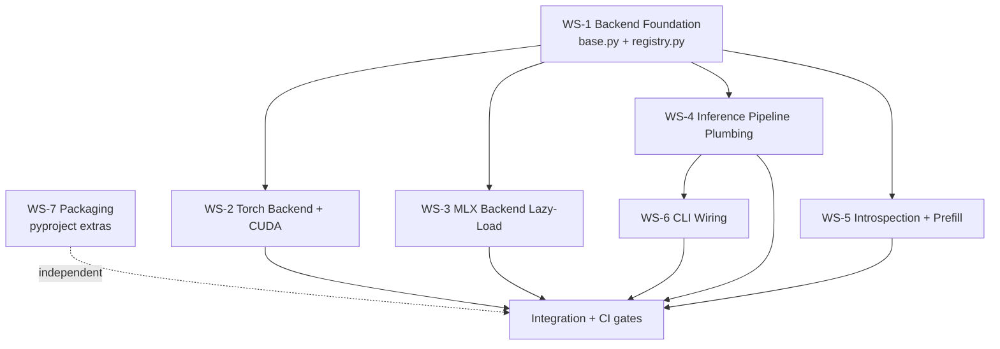

# Epic 1: Dual-Backend CUDA — Parallel Workstreams

## 1. Purpose

This document partitions the Epic 1 implementation (see
[`01-implementation-spec.md`](./01-implementation-spec.md)) into
non-conflicting, file-scoped workstreams. Each workstream defines a strict
set of **owned** files and **forbidden** files so multiple coding agents can
execute in parallel without merge conflicts.

Read `01-implementation-spec.md` first for the authoritative specification of
behavior, interfaces, and acceptance criteria. This document is purely about
**how to split and schedule** that work.

Rules every workstream MUST follow:

- Only edit files inside its **Owner scope**.
- Never edit files listed in its **Forbidden** set (owned by another stream).
- Respect **Inputs** — do not start until upstream streams have **merged to `main` with green CI** (not just PR-approved).
- New test files live under `tests/` mirroring the source path. If an existing test module at the mirrored path already covers the source file, extend it rather than creating a parallel file unless the workstream explicitly lists a **new** module.
- All MLX imports under `src/chuk_lazarus/inference/**`, `src/chuk_lazarus/introspection/hooks.py`, and `src/chuk_lazarus/cli/commands/context/prefill/_vec_inject.py` must be method-local (lazy); never top-level. (Epic 1 scope; other `introspection/**` files remain MLX-coupled and are deferred.)
- Glob semantics: `foo/` and `foo/**` mean the entire subtree under `foo/`. `foo/*.py` means only direct children. Owner scopes must list each file explicitly; forbidden sets may use either form but must be read as subtree-inclusive when written as `foo/` or `foo/**`.
- Alignment with impl spec: the registry function is `get_backend(name, device, check_sm)` per `01-implementation-spec.md` §4.2. No workstream should introduce a `registry.resolve()` alias.

---

## 2. Workstream Dependency Graph

Linear reading order: **Foundation (WS-1) → Backend Core (WS-2, WS-3) →
Inference (WS-4) → Introspection/Prefill (WS-5) → CLI (WS-6) → Tests
integration**. Packaging (WS-7) is independent and may land first.

---

## 3. Workstreams

### WS-1: Backend Foundation

Defines the abstract backend contract, the registry selection logic, and the
`CHUK_BACKEND` env-var parsing. All later streams depend on these
interfaces; it is the critical path.

| Field | Value |
|---|---|
| Owner scope | `src/chuk_lazarus/models_v2/core/backend/base.py`, `src/chuk_lazarus/models_v2/core/backend/registry.py`, `src/chuk_lazarus/models_v2/core/backend/__init__.py`, `src/chuk_lazarus/models_v2/core/backend/types.py`, `tests/models_v2/core/backend/test_registry.py` (extend existing), `tests/models_v2/core/backend/test_types.py` (extend if `BackendType` additions required) |
| Forbidden | `mlx_backend.py`, `torch_backend.py`, anything under `src/chuk_lazarus/inference/**`, `src/chuk_lazarus/cli/**`, `src/chuk_lazarus/introspection/**`, `pyproject.toml`, `README.md` |
| Inputs | None (entry point) |
| Outputs / Acceptance | `BackendBase.validate_device()` abstract method added; `get_backend(name: str \| None = None, device: str \| None = None, check_sm: bool = True)` (all params optional with the defaults shown) implemented with this precedence when `name` is `None`: (1) `CHUK_BACKEND` env var, (2) platform auto-detect (Darwin→`"mlx"`, else `"torch"`). An explicit non-`None` `name` always overrides the env var. Unknown backend raises `ValueError` with the message format `f"unknown backend: {name!r} (expected one of: 'mlx', 'torch')"`. Config-level fallback is plumbed in WS-4, not here. `test_registry.py` (extended) covers env override, explicit `name` overrides env, default platform fallback, unknown-backend `ValueError`, and caching semantics per impl spec §4.2. |
| Agent type | `code-surgeon` (for base/registry edits); `test-writer` for `test_registry.py` |
| Effort | M |

Blocks: WS-2, WS-3, WS-4, WS-5.

---

### WS-2: Torch Backend + CUDA

Implements RTX 5090 (sm_120) detection, dtype selection, and device
override in the torch backend.

| Field | Value |
|---|---|
| Owner scope | `src/chuk_lazarus/models_v2/core/backend/torch_backend.py`, `tests/models_v2/core/backend/test_torch_backend.py` (extend existing), **new** `tests/models_v2/core/backend/test_cuda_smoke.py` (skipped unless `CHUK_CUDA_SMOKE=1`) |
| Forbidden | `base.py`, `registry.py`, `types.py`, `__init__.py` under `models_v2/core/backend/`, `mlx_backend.py`, anything under `src/chuk_lazarus/inference/**`, `src/chuk_lazarus/cli/**`, `src/chuk_lazarus/introspection/**`, `pyproject.toml`, `README.md` |
| Inputs | WS-1 merged (needs `BackendBase.validate_device()` and `get_backend()`) |
| Outputs / Acceptance | SM capability detection (warn for sm_120 under older torch); dtype picked via CUDA capability (bf16 if major≥8 else fp16, fp32 for CPU); `--device` override honored through `TorchBackend.__init__(device, check_sm)`; torch tests green on Linux CPU via monkeypatched `torch.cuda.*`; `test_cuda_smoke.py` is skipped by default and runs only when `CHUK_CUDA_SMOKE=1` (pytest `skipif`) |
| Agent type | `code-surgeon` + `test-writer` |
| Effort | L |

---

### WS-3: MLX Backend Lazy-Load

Audit MLX backend to guarantee all `mlx`/`mlx_lm` imports are
method-local. No new MLX features; preserve current behavior exactly.

| Field | Value |
|---|---|
| Owner scope | `src/chuk_lazarus/models_v2/core/backend/mlx_backend.py`, `tests/models_v2/core/backend/test_mlx_backend.py` (extend: add one "no mlx import at module load" test only) |
| Forbidden | `base.py`, `registry.py`, `types.py`, `__init__.py` under `models_v2/core/backend/`, `torch_backend.py`, anything under `src/chuk_lazarus/inference/**`, `src/chuk_lazarus/cli/**`, `src/chuk_lazarus/introspection/**`, `pyproject.toml`, `README.md` |
| Inputs | WS-1 merged |
| Outputs / Acceptance | `python -c "import sys; import chuk_lazarus.models_v2.core.backend.mlx_backend as m; assert 'mlx' not in sys.modules"` passes; existing MLX tests still green on macOS |
| Agent type | `code-surgeon` |
| Effort | S |

---

### WS-4: Inference Pipeline Plumbing

Plumb backend selection through the unified pipeline, loader, and KV
generator. Make every MLX import lazy at function scope.

| Field | Value |
|---|---|
| Owner scope | `src/chuk_lazarus/inference/loader.py`, `src/chuk_lazarus/inference/unified.py`, `src/chuk_lazarus/inference/__init__.py`, `src/chuk_lazarus/inference/generator.py` (scope: move all top-level `import mlx.*` statements to function-local scope; no other changes), `src/chuk_lazarus/inference/context/kv_generator.py`, **new** `tests/ci/test_no_top_level_mlx.py` (AST gate — see §9; also creates the `tests/ci/` directory and its `__init__.py` if missing), **new** `tests/inference/test_loader_backend.py`, **new** `tests/inference/test_unified_backend.py`, **new** `tests/inference/test_kv_generator_backend.py` |
| Forbidden | All `src/chuk_lazarus/models_v2/core/backend/**`, `src/chuk_lazarus/cli/**`, `src/chuk_lazarus/introspection/**`, `src/chuk_lazarus/inference/backends/**` (legacy dual-registry; out-of-scope per §10), every file under `src/chuk_lazarus/inference/context/**` EXCEPT `kv_generator.py` (the `EXCEPT` clause overrides the subtree forbid-rule for this one file), `src/chuk_lazarus/inference/chat.py`, `src/chuk_lazarus/inference/virtual_expert.py`, `src/chuk_lazarus/inference/generation.py` (already lazy), `pyproject.toml`, `README.md` |
| Inputs | WS-1 merged |
| Outputs / Acceptance | `UnifiedPipelineConfig` exposes `backend: str \| None = None`, `device: str \| None = None`, and `cuda_check_sm: bool = True` (all three added here — WS-6 reads these read-only); the existing `Field(description=...)` for `backend` in `unified.py` is updated to reference `CHUK_BACKEND` instead of the legacy `LAZARUS_BACKEND` string; loader calls `get_backend(name=config.backend, device=config.device, check_sm=config.cuda_check_sm)` from the new `models_v2/core/backend` registry. Epic 1 does NOT remove the legacy `inference/backends/resolve_backend` call sites; the new and legacy registries coexist and unification is deferred (see §10). No top-level `import mlx` or `import mlx_lm` in any file in owner scope, verified by BOTH sub-tests in `tests/ci/test_no_top_level_mlx.py` (AST + runtime `sys.modules`, see §9). `inference/__init__.py` changes are additive only (no renames/removals of existing exports). New test modules cover both backends under monkeypatched `get_backend`. |
| Agent type | `code-surgeon` (plumbing) + `test-writer` |
| Effort | XL (≈2.3 kLOC touched across five production files — `loader.py`, `unified.py`, `__init__.py`, `generator.py`, `kv_generator.py` — plus one new CI-gate test and three new backend test modules). If capacity is tight, the team-lead (not the executing agent) MAY split into WS-4a {`loader.py` + `unified.py` + `__init__.py` + `generator.py` + the new CI-gate test} and WS-4b {`kv_generator.py`}, with 4b depending on 4a merged; this split is a team-lead decision and must be declared before work starts. Without an explicit split declaration, WS-4 is a single stream. |

---

### WS-5: Introspection + Prefill

Remove the hard MLX dependency in introspection hooks and vector-prefill
injection, replacing with backend-dispatched tensor ops.

**Scope note (read first):** Epic 1 intentionally de-couples ONLY
`introspection/hooks.py` and `cli/commands/context/prefill/_vec_inject.py`.
The remaining ~100 files under `src/chuk_lazarus/introspection/` stay
MLX-coupled and are deferred (see §10). This is acceptable only if those
files are not imported on the Epic 1 hot path; runtime isolation is
validated by the CI gate in §9, which fails if importing any Epic 1
in-scope module transitively loads `mlx`.

| Field | Value |
|---|---|
| Owner scope | `src/chuk_lazarus/introspection/hooks.py`, `src/chuk_lazarus/cli/commands/context/prefill/_vec_inject.py`, **new** `tests/introspection/test_hooks_backend.py`, **new** `tests/cli/commands/context/prefill/test_vec_inject_backend.py` |
| Forbidden | All `src/chuk_lazarus/introspection/**` files EXCEPT `hooks.py`, all `src/chuk_lazarus/cli/commands/context/prefill/**` files EXCEPT `_vec_inject.py`, anything under `src/chuk_lazarus/inference/**`, anything under `src/chuk_lazarus/models_v2/**`, `pyproject.toml`, `README.md`. (Scope note: Epic 1 intentionally only de-couples `hooks.py` and `_vec_inject.py`; the remaining `introspection/**` tree stays MLX-coupled and is deferred to a later epic.) |
| Inputs | WS-1 merged (so it can call `get_backend()`) |
| Outputs / Acceptance | MLX imports in `hooks.py` and `_vec_inject.py` are method-local; tensor conversion path dispatches on backend via `get_backend()`; existing MLX-pathway behavior unchanged; both new smoke tests run with `CHUK_BACKEND=torch` and assert `'mlx' not in sys.modules` after importing the module under test |
| Agent type | `code-surgeon` |
| Effort | M |

---

### WS-6: CLI Wiring

Surface `--backend` as an explicit CLI flag on `infer run` and thread it
down into the unified config.

| Field | Value |
|---|---|
| Owner scope | `src/chuk_lazarus/cli/_parsers/_infer.py` (the actual argparse registration site; scope: (a) update the existing `--backend` flag's `choices=["mlx", "cuda"]` to `choices=["mlx", "torch"]` to match the canonical backend names used by WS-1's `get_backend()` and by `BackendType`; (b) update the `--backend` help text to reference `CHUK_BACKEND` instead of the legacy `LAZARUS_BACKEND`; (c) add a new `--device` flag (string, optional, no `choices`, help text: "Device override (e.g., 'cuda:0', 'mps', 'cpu'); defaults to backend auto-selection"); no other changes to existing flags), `src/chuk_lazarus/cli/commands/infer/run.py`, `src/chuk_lazarus/cli/commands/infer/_types.py` (scope: add two dataclass/Field fields — `backend: str \| None = None` and `device: str \| None = None` — and two lines in `from_args()` reading `getattr(args, "backend", None)` / `getattr(args, "device", None)`; no refactors of existing fields or methods), `src/chuk_lazarus/cli/commands/infer/__init__.py` (scope: additive re-exports only if needed; no refactors), **new** `tests/cli/test_infer_backend.py` |
| Forbidden | `src/chuk_lazarus/cli/_parsers/**` EXCEPT `_infer.py` (the EXCEPT overrides the subtree forbid for that one file), anything under `src/chuk_lazarus/cli/commands/context/**`, anything under `src/chuk_lazarus/cli/commands/**` other than `infer/`, `src/chuk_lazarus/inference/**`, `src/chuk_lazarus/models_v2/**`, `src/chuk_lazarus/introspection/**`, `pyproject.toml`, `README.md` |
| Inputs | WS-4 merged (`UnifiedPipelineConfig.backend` and `.cuda_check_sm` must exist). WS-6 consumes `UnifiedPipelineConfig` via read-only imports; it does not edit any file under `inference/`. |
| Outputs / Acceptance | `chuk-lazarus infer run --backend torch …` works; flag absent → falls back to `CHUK_BACKEND` env then platform auto-detect (matches WS-1 precedence); help text references `CHUK_BACKEND` (not `LAZARUS_BACKEND`); `--device` flag also registered and propagates to `UnifiedPipelineConfig.device`; `test_infer_backend.py` uses the project's CLI runner to assert the flag values propagate into `UnifiedPipelineConfig.backend` and `.device` |
| Agent type | `code-surgeon` + `test-writer` |
| Effort | S |

---

### WS-7: Packaging

Declare extras and update install snippets. Fully independent; may land
first to unblock local dev installs.

| Field | Value |
|---|---|
| Owner scope | `pyproject.toml` (ADD extras only; do NOT remove existing base deps until the full Epic lands), `README.md` (only the "Installation" / install-snippet section — delimited by the existing `## Installation` heading and the next top-level heading) |
| Forbidden | Any file under `src/`, `tests/`, or `docs/`, and any non-installation section of `README.md` |
| Inputs | None for the extras-addition path. If WS-7 also plans to remove the implicit `mlx`/`mlx-lm` base dependency, that removal is blocked on WS-4 + WS-5 merging (otherwise `pip install -e .` without extras will import-break on Linux). |
| Outputs / Acceptance | Extras `mlx`, `torch`, `torch-cuda`, `all` added; `pip install -e .[mlx]` and `pip install -e .[torch-cuda]` both resolve cleanly in fresh virtualenvs on macOS and Linux respectively; README install snippet documents the new extras. Base deps untouched in this PR. |
| Agent type | `code-surgeon` |
| Effort | S |

---

## 4. Conflict Matrix

Rows and columns are workstreams; a `1` means they touch at least one
common file. Target: off-diagonal all `0`.

|       | WS-1 | WS-2 | WS-3 | WS-4 | WS-5 | WS-6 | WS-7 |
|-------|------|------|------|------|------|------|------|
| WS-1  |  -   |  0   |  0   |  0   |  0   |  0   |  0   |
| WS-2  |  0   |  -   |  0   |  0   |  0   |  0   |  0   |
| WS-3  |  0   |  0   |  -   |  0   |  0   |  0   |  0   |
| WS-4  |  0   |  0   |  0   |  -   |  0   |  0   |  0   |
| WS-5  |  0   |  0   |  0   |  0   |  -   |  0   |  0   |
| WS-6  |  0   |  0   |  0   |  0   |  0   |  -   |  0   |
| WS-7  |  0   |  0   |  0   |  0   |  0   |  0   |  -   |

Shared-edit exception:
- `tests/ci/test_no_top_level_mlx.py` is owned by WS-4 but its in-scope
  constant list is appended-to by any later stream that adds a file to
  the Epic 1 AST-check set. WS-5 is the only current consumer of this
  exception (it appends `hooks.py` and `_vec_inject.py`). Because WS-4
  seeds the full Epic 1 list at creation time, WS-5 does not need to
  edit this file in practice; the exception is documented only to cover
  the edge case of a last-minute additional path.

Notes:
- WS-2 and WS-3 both live under `models_v2/core/backend/` but each owns
  exactly one backend-specific file plus its matching test module, so there
  is no file overlap.
- WS-4 and WS-5 both contain code that transitively imports through
  `inference/__init__.py`, but only WS-4 edits that file; WS-5 consumes
  its exports read-only. WS-4 is required to keep `inference/__init__.py`
  changes additive (no renames, no removals) so WS-5 cannot observe a
  mid-stream API churn.
- No workstream owns `tests/**/conftest.py` or any fixture files; Epic 1
  does not require conftest changes. If an implementer discovers a
  conftest edit is unavoidable, they must raise it for re-scoping rather
  than editing silently.
- Any diff that touches a forbidden file must be rebased or re-scoped
  before review.

---

## 5. Merge Order & Integration Points

Recommended PR sequence:

1. **WS-7 Packaging** (optional early land for extras-addition only; base-dep
   removal deferred to post-Epic cleanup).
2. **WS-1 Backend Foundation** — *gate*: unit tests for registry + env parsing.
3. **WS-2 Torch Backend** and **WS-3 MLX Backend Lazy-Load** in parallel — *gate*:
   per-backend unit tests; CUDA smoke gated by `CHUK_CUDA_SMOKE=1`.
4. **WS-4 Inference Plumbing** — *gate*: loader/unified/kv_generator tests,
   the `tests/ci/test_no_top_level_mlx.py` AST check (see §9) green. WS-4
   owns the creation of the AST check and seeds its in-scope constant list
   with the Epic 1 paths (WS-4 + WS-5 files); subsequent edits to that
   constant list are scoped as "shared-edit" exceptions noted in §4.
5. **WS-5 Introspection + Prefill** — *gate*: AST check green (already
   covers `hooks.py` and `_vec_inject.py` from the seeded list); per-backend
   smoke tests green.
6. **WS-6 CLI Wiring** — *gate*: CLI runner tests. CI is not expected to
   run `tests/ci/test_no_top_level_mlx.py` on WS-1/WS-2/WS-3 PRs because
   the file does not exist yet on those branches; the gate becomes
   mandatory starting with WS-4's PR.

"Merged" in this document always means: commit is on `main` with the full
CI matrix green. A PR that is approved but not yet merged does NOT unblock
downstream workstreams.

CI must run on every PR: `pytest tests/models_v2/core/backend`,
`pytest tests/inference`, `pytest tests/cli`, `pytest tests/introspection`,
and `pytest tests/ci/test_no_top_level_mlx.py`.

---

## 6. Parallelization Plan

Once **WS-1** merges, the safe concurrency pattern is:

- **Wave A** (max 4 agents concurrent): WS-2, WS-3, WS-4, WS-5. None share
  files. WS-7 may also still be in flight.
- **Wave B** (1 agent): WS-6 starts only after WS-4 merges.

Practical cap: 4 concurrent coding agents in Wave A + 1 reviewer agent. Any
higher concurrency targets the same reviewer bottleneck and does not help.

---

## 7. Rollback Plan per Stream

Rollback ordering rule: once a downstream WS has merged to `main`, reverting
an upstream WS requires cascading reverts in reverse merge order (e.g.,
reverting WS-1 after WS-4 merged requires reverting WS-4/5/6 first). The
soft-rollback escape hatch (`CHUK_BACKEND=mlx`) is the preferred first
response for regressions that only affect the torch path.

| Stream | Rollback |
|--------|----------|
| WS-1 | If no dependents merged: `git revert` the foundation PR. If dependents merged: cascade-revert WS-6 → WS-5 → WS-4 → WS-3/WS-2 → WS-1 in that order. |
| WS-2 | `git revert` torch_backend.py changes; MLX path unaffected |
| WS-3 | `git revert` mlx_backend.py changes; lazy-loading reverts cleanly |
| WS-4 | `git revert` inference/* PR; registry stays but pipeline returns to implicit MLX |
| WS-5 | `git revert` introspection/prefill PR; MLX-only path restored |
| WS-6 | Remove `--backend` flag via single-file revert; env var still works |
| WS-7 | Revert `pyproject.toml` and README install section |

For soft rollback without revert, `CHUK_BACKEND=mlx` forces the
pre-existing behavior on any merged state.

---

## 8. Definition of Done (Epic 1)

- All seven workstreams merged to `main`.
- MLX test suite green on macOS (`pytest tests/models_v2 tests/inference tests/cli`).
- Torch test suite green on Linux CPU without MLX installed.
- Optional CUDA smoke test green on RTX 5090 host with
  `CHUK_CUDA_SMOKE=1`.
- `pip install -e .[mlx]` and `pip install -e .[torch-cuda]` both install
  cleanly in fresh virtualenvs.
- No top-level `import mlx` or `import mlx_lm` remains in the Epic 1
  in-scope files — specifically the set enumerated by
  `EPIC_1_IN_SCOPE` in `tests/ci/test_no_top_level_mlx.py`. That set
  explicitly EXCLUDES `src/chuk_lazarus/inference/backends/**` (the
  legacy dual-registry, deferred per §10), `src/chuk_lazarus/inference/chat.py`
  and `inference/virtual_expert.py` (not on the Epic 1 hot path), and
  the ~100 `introspection/**` files other than `hooks.py`. Those files
  are permitted to keep top-level MLX imports. Verified mechanically by
  `tests/ci/test_no_top_level_mlx.py` (AST + runtime, see §9).
- `chuk-lazarus infer run --backend {mlx,torch}` runs end-to-end on the
  matching platform.

---

## 9. CI Gate: No Top-Level MLX Imports

WS-4 introduces a CI-enforced check at
`tests/ci/test_no_top_level_mlx.py`. The file contains TWO parametrized
test functions that both must be green:

1. `test_no_mlx_ast_imports(path)` — STATIC AST check. Parses each file
   with `ast.parse`, walks only the module body (does NOT recurse into
   `FunctionDef` or `AsyncFunctionDef` bodies — class bodies ARE
   checked), and fails if any `Import` or `ImportFrom` node names `mlx`
   or `mlx_lm`. Exemptions:
   - Imports inside an `If` node whose test is either
     `ast.Name(id="TYPE_CHECKING")` or `ast.Attribute(attr="TYPE_CHECKING")`
     (covers both `TYPE_CHECKING` and `typing.TYPE_CHECKING` forms).
   - Imports inside a module-level `Try` block that has a matching
     `ExceptHandler` for `ImportError` (standard optional-dependency
     idiom) are permitted.
   - Assertion message on failure: `f"{path}: top-level import of {name!r} at line {lineno}"`.

2. `test_no_mlx_runtime_imports(path)` — RUNTIME `sys.modules` check.
   For each file, spawns a subprocess with `CHUK_BACKEND=torch` in the
   environment, imports the corresponding module, and asserts
   `'mlx' not in sys.modules and 'mlx_lm' not in sys.modules`. This
   catches transitive imports that the AST check cannot see.

Scope inputs to both tests are read from ONE module-level constant
`EPIC_1_IN_SCOPE: list[str]` inside the test file. WS-4 seeds the list
with ONLY the files it owns (at minimum: `inference/loader.py`,
`inference/unified.py`, `inference/__init__.py`, `inference/generator.py`,
`inference/context/kv_generator.py`). Paths are strings relative to the
repo root; no globs. WS-5 appends its own files (`introspection/hooks.py`,
`cli/commands/context/prefill/_vec_inject.py`) to the list when it
merges — this is the one shared-edit exception documented in §4. The
choice to keep WS-4's initial seed limited to WS-4 files means WS-4
does not block on WS-5 cleanliness.

---

## 10. Out-of-Scope for Epic 1 (Flagged Gaps)

The following items were raised during review but are explicitly deferred.
They are documented here so reviewers do not re-raise them and so a
follow-on epic can pick them up with full context:

- **Introspection subtree MLX coupling:** ~100 files under
  `src/chuk_lazarus/introspection/` (excluding `hooks.py`) still have
  top-level MLX imports. Epic 1 intentionally touches only `hooks.py`
  because it is the hotpath used by the CLI prefill flow. Runtime
  isolation — i.e., the Epic 1 code paths must never transitively import
  these files on Linux without mlx installed — is enforced by the §9 AST
  gate's import-execution test: importing each Epic 1 in-scope module
  under `CHUK_BACKEND=torch` and asserting `'mlx' not in sys.modules`. If
  the gate fails because some Epic 1 module transitively loads an
  introspection file, the offending import chain must be lazified in the
  owning workstream BEFORE that stream merges; the fix is not deferred
  to a later epic. A follow-on epic will still audit the remaining
  introspection files for the fully-introspection-enabled torch path.
- **`src/chuk_lazarus/inference/backends/` (legacy dual-registry):** a
  second backend registry exists under `inference/backends/` using the
  `LAZARUS_BACKEND` env var. Epic 1 does not unify or deprecate it; the
  new canonical registry lives at `models_v2/core/backend/`. Unification
  is a separate epic.
- **Mandatory RTX 5090 smoke test in CI:** running `CHUK_CUDA_SMOKE=1` on
  real sm_120 hardware in CI is out of scope; Epic 1 ships mocked
  capability-detection tests and an opt-in smoke test. "Readiness" in
  §8 means "the code path exists and passes static checks", not "verified
  on a real 5090".
- **Migration / changelog docs:** any user-facing migration guide for the
  new `CHUK_BACKEND` env var, `--backend` flag, and behaviour change (no
  silent CPU fallback on Linux) is owned by the release PR that closes
  Epic 1, not by any individual workstream.
- **`cli/commands/infer/_types.py` field bloat:** WS-6 adds two fields
  (`backend`, `device`). Any further CLI-level config surface belongs to
  a later epic.
